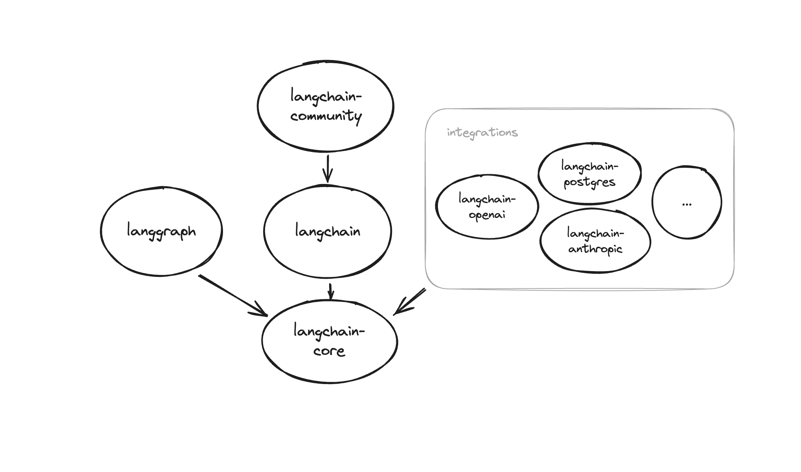

# 如何安装 LangChain 包

LangChain 生态系统分为不同的包，这让你可以精确选择要安装的功能模块。

## 官方发布版本

要安装主 `langchain` 包，运行：

### Pip

```bash
pip install langchain
```

### Pip

```bash
conda install langchain -c conda-forge
```

虽然该包是使用 LangChain 的合理起点，但 LangChain 的大部分价值在于与各种模型提供商、数据存储等的集成。默认情况下，进行这些集成所需的依赖 **不会安装**。你需要单独安装特定集成所需的依赖，下面会展示如何操作。

## 生态系统包

除了 `langsmith` SDK 外，LangChain 生态系统中的所有包都依赖于 `langchain-core`，它包含其他包使用的基础类和抽象。下面的依赖图展示了不同包之间的关系。箭头表示源包依赖目标包：



安装某个包时，你无需显式安装该包的依赖（如 `langchain-core`）。
但是，如果你只使用该依赖的特定版本功能，你也可以选择显式安装。此时应确保已安装或固定的版本与其他集成包兼容。

### LangChain 核心

`langchain-core` 包包含了 LangChain 生态系统其余部分使用的基础抽象，以及 LangChain 表达式语言（LCEL）。它会被 `langchain` 自动安装，但也可以单独使用。安装命令：

```bash
pip install langchain-core
```

### 集成包

某些集成如 OpenAI 和 Anthropic 有自己的包。需要单独包的集成会在 [集成文档](https://langchain-doc.cn/integrations/providers/) 中说明。
你可以在 [API reference](https://python.langchain.com/api_reference/) 的 "Partner libs" 下拉菜单中查看所有集成包列表。安装示例：

```bash
pip install langchain-openai
```

尚未拆分为独立包的集成会存在于 `langchain-community` 包中。安装命令：

```bash
pip install langchain-community
```

### LangChain 实验包

`langchain-experimental` 包包含实验性 LangChain 代码，适用于研究和实验用途。安装命令：

```bash
pip install langchain-experimental
```

### LangGraph

`langgraph` 是用于构建带状态、多参与者 LLM 应用的库。它可以与 LangChain 平滑集成，也可以独立使用。安装命令：

```bash
pip install langgraph
```

### LangServe

LangServe 帮助开发者将 LangChain runnables 和 chains 部署为 REST API。
LangServe 会随 LangChain CLI 自动安装。
如果不使用 LangChain CLI，可安装：

```bash
pip install "langserve[all]"
```

以安装客户端和服务端依赖。或者仅安装客户端代码：`pip install "langserve[client]"`，或仅安装服务端代码：`pip install "langserve[server]"`。

### LangChain CLI

LangChain CLI 对于使用 LangChain 模板及其他 LangServe 项目很有用。安装命令：

```bash
pip install langchain-cli
```

### LangSmith SDK

LangSmith SDK 会随 LangChain 自动安装。但它 **不依赖** `langchain-core`，也可以独立安装和使用。
如果你不使用 LangChain，可以安装：

```bash
pip install langsmith
```

### 从源码安装

如果你想从源码安装某个包，可以通过克隆 [LangChain 主仓库](https://github.com/langchain-ai/langchain)，进入你想安装的包目录 `PATH/TO/REPO/langchain/libs/{package}`，然后运行：

```bash
pip install -e .
```

LangGraph、LangSmith SDK 以及部分集成包存在于主 LangChain 仓库之外。
你可以在 [这里查看所有仓库](https://github.com/langchain-ai)。