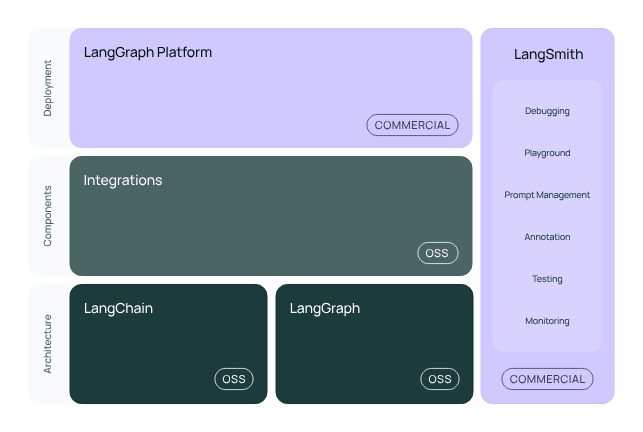

# 介绍

**LangChain** 是一个用于开发由大型语言模型（LLM）驱动的应用程序的框架。

LangChain 简化了 LLM 应用程序生命周期的每个阶段：

*   **开发**：使用 LangChain 的开源[组件](https://langchain-doc.cn/concepts)和[第三方集成](https://langchain-doc.cn/integrations/providers/)构建应用程序。
    使用 [LangGraph](https://langchain-doc.cn/concepts/architecture/#langgraph) 构建支持一流流式传输和人类在环的有状态智能体。
*   **生产化**：使用 [LangSmith](https://docs.smith.langchain.com/) 检查、监控和评估您的应用程序，从而能够持续优化并自信地部署。
*   **部署**：使用 [LangGraph 平台](https://docs.langchain.com/langgraph-platform) 将您的 LangGraph 应用程序转化为可用于生产的 API 和助手。


*LangChain 框架概览*

LangChain 为大型语言模型及相关技术（如嵌入模型和向量存储）实现了标准接口，并与数百个提供商集成。更多信息请参见[集成页面](https://langchain-doc.cn/integrations/providers/)。

## 接入聊天模型

### OpenAI

```
pip install -qU "langchain[openai]"
```

```python
import getpass
import os
if not os.environ.get("OPENAI_API_KEY"):
  os.environ["OPENAI_API_KEY"] = getpass.getpass("Enter API key for OpenAI: ")
from langchain.chat_models import init_chat_model
model = init_chat_model("gpt-4o-mini", model_provider="openai")
```

```python
model.invoke("Hello, world!")
```

### Anthropic

```
pip install -qU "langchain[anthropic]"
```

```python
import getpass
import os
if not os.environ.get("ANTHROPIC_API_KEY"):
  os.environ["ANTHROPIC_API_KEY"] = getpass.getpass("Enter API key for Anthropic: ")
from langchain.chat_models import init_chat_model
model = init_chat_model("claude-3-5-sonnet-latest", model_provider="anthropic")
```

```python
model.invoke("Hello, world!")
```

> 注
> 这些文档主要介绍 Python 版 LangChain 库。[点击这里](https://js.langchain.com)查看 JavaScript 版 LangChain 文档。

## 架构

LangChain 框架由多个开源库组成。详细信息请参阅[架构](https://langchain-doc.cn/concepts/architecture/)页面。

*   **`langchain-core`**：聊天模型及其他组件的基础抽象。
*   **集成包**（例如 `langchain-openai`、`langchain-anthropic` 等）：重要的集成被拆分为轻量级包，由 LangChain 团队和集成开发者共同维护。
*   **`langchain`**：构成应用程序认知架构的链、智能体和检索策略。
*   **`langchain-community`**：由社区维护的第三方集成。
*   **`langgraph`**：用于将 LangChain 组件组合成具有持久化、流式传输等关键功能的生产就绪应用程序的编排框架。详情见 [LangGraph 文档](https://langchain-ai.github.io/langgraph/)。

## 指南

### [教程](../tutorials.html)

如果您想构建特定应用或偏向实践操作，请查看我们的[教程部分](../tutorials.html)。
这是入门的最佳起点。

推荐的入门教程有：

*   [构建简单的 LLM 应用](https://langchain-doc.cn/tutorials/llm_chain)
*   [构建聊天机器人](https://langchain-doc.cn/tutorials/chatbot)
*   [构建智能体](https://langchain-doc.cn/tutorials/agents)
*   [LangGraph 入门](https://langchain-ai.github.io/langgraph/tutorials/introduction/)

查看完整的 LangChain 教程列表[这里](../tutorials.html)，以及其他 [LangGraph 教程](https://langchain-ai.github.io/langgraph/tutorials/)。
想了解更多 LangGraph，可以查看我们的 LangChain Academy 首门课程 *Introduction to LangGraph*，[点击这里](https://academy.langchain.com/courses/intro-to-langgraph) 学习。

### [操作指南](../how_to.html)

在[这里](../how_to.html)您可以找到“如何做……”类型问题的简短解答。
这些操作指南不会深入讲解主题——相关内容可以在[教程](../tutorials.html)和[API 参考](https://python.langchain.com/api_reference/)中找到。
但这些指南可以帮助您快速完成使用[聊天模型](../how_to/index.html#chat-models)、[向量存储](../how_to/index.html#vector-stores)及其他常用 LangChain 组件的常见任务。

查看 [LangGraph 专属操作指南](https://langchain-ai.github.io/langgraph/how-tos/)。

### [概念指南](https://langchain-doc.cn/concepts)

介绍您需要了解的所有 LangChain 关键概念！[这里](https://langchain-doc.cn/concepts)提供了对所有 LangChain 概念的高层次解释。

若想深入了解 LangGraph 概念，请参阅[此页面](https://langchain-ai.github.io/langgraph/concepts/)。

### [集成](https://langchain-doc.cn/integrations/providers/index.mdx)

LangChain 是丰富工具生态系统的一部分，这些工具可以与我们的框架集成并在其上构建。
如果您希望快速上手[聊天模型](https://langchain-doc.cn/integrations/chat/)、[向量存储](https://langchain-doc.cn/integrations/vectorstores)或来自特定提供商的其他 LangChain 组件，请查看我们不断扩展的[集成列表](https://langchain-doc.cn/integrations/providers/)。

### [API 参考](https://python.langchain.com/api_reference/)

查看 API 参考以获取 LangChain Python 包中所有类和方法的完整文档。

## 生态系统

### [🦜🛠️ LangSmith](https://docs.smith.langchain.com)

追踪并评估您的语言模型应用程序和智能体，帮助您从原型迈向生产环境。

### [🦜🕸️ LangGraph](https://langchain-ai.github.io/langgraph)

构建有状态、多参与者的 LLM 应用程序。与 LangChain 无缝集成，也可独立使用。LangGraph 支持生产级智能体，受到 LinkedIn、Uber、Klarna、GitLab 等众多企业信赖。

## 其他资源

### [版本](https://langchain-doc.cn/versions/v0_3/)

查看 v0.3 的更新内容，学习如何迁移旧代码，了解版本管理策略等。

### [安全](https://langchain-doc.cn/security)

阅读[安全](https://langchain-doc.cn/security)最佳实践，确保您在使用 LangChain 开发时安全可靠。

### [贡献指南](https://langchain-doc.cn/contributing/index.mdx)

查看开发者指南，了解贡献规范并帮助搭建开发环境。