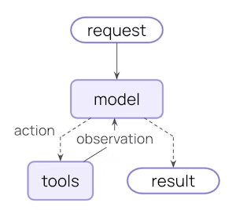
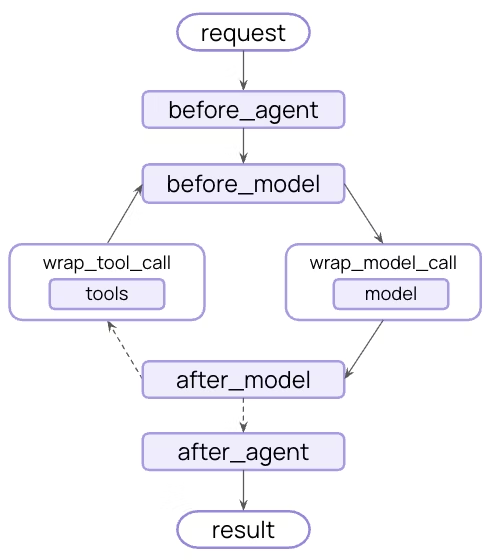

# 中间件

> 控制并定制代理（Agent）执行的每一个步骤

中间件提供了一种方法，可以更精细地控制**代理**（Agent）内部的执行流程。

核心的代理循环包括调用模型、让模型选择并执行工具，然后在模型不再调用工具时结束：



中间件在这些步骤的**之前**和**之后**暴露了钩子 (hooks)：



## 中间件可以做什么？

*   **监控 (Monitor)**
    追踪代理行为，包括日志记录、分析和调试。
*   **修改 (Modify)**
    转换提示词（prompts）、工具选择和输出格式。
*   **控制 (Control)**
    添加重试、回退和提前终止逻辑。
*   **强制执行 (Enforce)**
    应用速率限制、安全防护（guardrails）和个人身份信息（PII）检测。

通过将其传递给 `create_agent` 函数来添加中间件：

```python
from langchain.agents import create_agent
from langchain.agents.middleware import SummarizationMiddleware, HumanInTheLoopMiddleware
agent = create_agent(
    model="openai:gpt-4o",
    tools=[...],
    middleware=[SummarizationMiddleware(), HumanInTheLoopMiddleware()],
)
```

## 预置中间件 (Built-in middleware)

LangChain 为常见用例提供了预构建的中间件：

### 摘要 (Summarization)

在接近**上下文窗口**（token limits）限制时，自动对对话历史进行摘要。

> **完美适用于：**
> *   超过上下文窗口的**长期对话**
> *   具有大量历史记录的**多轮对话**
> *   需要保留完整对话上下文的应用

```python
from langchain.agents import create_agent
from langchain.agents.middleware import SummarizationMiddleware
agent = create_agent(
    model="openai:gpt-4o",
    tools=[weather_tool, calculator_tool],
    middleware=[
        SummarizationMiddleware(
            model="openai:gpt-4o-mini",
            max_tokens_before_summary=4000,  # 在 4000 个 token 时触发摘要
            messages_to_keep=20,  # 摘要后保留最近 20 条消息
            summary_prompt="Custom prompt for summarization...",  # 可选
        ),
    ],
)
```

**配置选项：**

*   `model`: **字符串**，用于生成摘要的模型。
*   `max_tokens_before_summary`: **数字**，触发摘要的 token 阈值。
*   `messages_to_keep`: **数字 (默认值: 20)**，要保留的最新消息数量。
*   `token_counter`: **函数**，自定义 token 计数函数。默认为基于字符的计数。
*   `summary_prompt`: **字符串**，自定义提示词模板。如果未指定，则使用内置模板。
*   `summary_prefix`: **字符串 (默认值: "## Previous conversation summary:")**，摘要消息的前缀。

### 人在回路中 (Human-in-the-loop)

在工具执行之前，暂停代理执行以供人工批准、编辑或拒绝工具调用。

> **完美适用于：**
> *   需要人工批准的**高风险操作**（数据库写入、金融交易）
> *   强制要求人工监督的**合规工作流**
> *   使用人工反馈来指导代理的**长期对话**

```python
from langchain.agents import create_agent
from langchain.agents.middleware import HumanInTheLoopMiddleware
from langgraph.checkpoint.memory import InMemorySaver
agent = create_agent(
    model="openai:gpt-4o",
    tools=[read_email_tool, send_email_tool],
    checkpointer=InMemorySaver(),
    middleware=[
        HumanInTheLoopMiddleware(
            interrupt_on={
                # 要求对发送邮件进行批准、编辑或拒绝
                "send_email_tool": {
                    "allowed_decisions": ["approve", "edit", "reject"],
                },
                # 自动批准读取邮件
                "read_email_tool": False,
            }
        ),
    ],
)
```

**配置选项：**

*   `interrupt_on`: **字典 (必需)**，工具名称到批准配置的映射。值可以是 `True`（使用默认配置中断）、`False`（自动批准）或一个 `InterruptOnConfig` 对象。
*   `description_prefix`: **字符串 (默认值: "Tool execution requires approval")**，操作请求描述的前缀。

**`InterruptOnConfig` 选项：**

*   `allowed_decisions`: **字符串列表**，允许的决定列表：`"approve"`、`"edit"` 或 `"reject"`。
*   `description`: **字符串 | 可调用对象**，用于自定义描述的静态字符串或可调用函数。

> **⚠️ 重要提示：** “人在回路中”中间件需要一个**检查点**（checkpointer）来在中断期间维护状态。

### 缓存 (Anthropic prompt caching)

通过使用 Anthropic 模型，缓存重复的提示词前缀以降低成本。

> **完美适用于：**
> *   具有**冗长、重复系统提示词**的应用
> *   在多次调用中**重用相同上下文**的代理
> *   为高流量部署**降低 API 成本**

> **ℹ️ 了解更多：** 请参阅 [Anthropic 提示词缓存](https://docs.claude.com/en/docs/build-with-claude/prompt-caching#cache-limitations)策略和限制。

```python
from langchain_anthropic import ChatAnthropic
from langchain_anthropic.middleware import AnthropicPromptCachingMiddleware
from langchain.agents import create_agent
LONG_PROMPT = """
Please be a helpful assistant.
<Lots more context ...>
"""
agent = create_agent(
    model=ChatAnthropic(model="claude-sonnet-4-latest"),
    system_prompt=LONG_PROMPT,
    middleware=[AnthropicPromptCachingMiddleware(ttl="5m")],
)
# 缓存存储
agent.invoke({"messages": [HumanMessage("Hi, my name is Bob")]})
# 缓存命中，系统提示词被缓存
agent.invoke({"messages": [HumanMessage("What's my name?")]})
```

**配置选项：**

*   `type`: **字符串 (默认值: "ephemeral")**，缓存类型。目前仅支持 `"ephemeral"`。
*   `ttl`: **字符串 (默认值: "5m")**，缓存内容的存活时间 (Time to live)。有效值：`"5m"` 或 `"1h"`。
*   `min_messages_to_cache`: **数字 (默认值: 0)**，开始缓存之前的最小消息数量。
*   `unsupported_model_behavior`: **字符串 (默认值: "warn")**，使用非 Anthropic 模型时的行为。选项：`"ignore"`、`"warn"` 或 `"raise"`。

### 限制模型调用 (Model call limit)

限制模型调用的次数，以防止无限循环或成本过高。

> **完美适用于：**
> *   防止**失控代理**进行过多 API 调用
> *   在生产部署中**强制执行成本控制**
> *   在特定调用预算内**测试代理行为**

```python
from langchain.agents import create_agent
from langchain.agents.middleware import ModelCallLimitMiddleware
agent = create_agent(
    model="openai:gpt-4o",
    tools=[...],
    middleware=[
        ModelCallLimitMiddleware(
            thread_limit=10,  # 每个线程（跨多次运行）最多 10 次调用
            run_limit=5,  # 每次运行（单次调用）最多 5 次调用
            exit_behavior="end",  # 或者 "error" 以引发异常
        ),
    ],
)
```

**配置选项：**

*   `thread_limit`: **数字**，线程中所有运行的最大模型调用次数。默认为无限制。
*   `run_limit`: **数字**，单次调用中最大模型调用次数。默认为无限制。
*   `exit_behavior`: **字符串 (默认值: "end")**，达到限制时的行为。选项：`"end"`（优雅终止）或 `"error"`（引发异常）。

### 限制工具调用 (Tool call limit)

限制特定工具或所有工具的调用次数。

> **完美适用于：**
> *   防止对昂贵的外部 API 进行**过多调用**
> *   限制**网页搜索**或**数据库查询**
> *   对特定工具使用**强制执行速率限制**

```python
from langchain.agents import create_agent
from langchain.agents.middleware import ToolCallLimitMiddleware
# 限制所有工具调用
global_limiter = ToolCallLimitMiddleware(thread_limit=20, run_limit=10)
# 限制特定工具
search_limiter = ToolCallLimitMiddleware(
    tool_name="search",
    thread_limit=5,
    run_limit=3,
)
agent = create_agent(
    model="openai:gpt-4o",
    tools=[...],
    middleware=[global_limiter, search_limiter],
)
```

**配置选项：**

*   `tool_name`: **字符串**，要限制的特定工具。如果未提供，则限制适用于所有工具。
*   `thread_limit`: **数字**，线程中所有运行的最大工具调用次数。默认为无限制。
*   `run_limit`: **数字**，单次调用中最大工具调用次数。默认为无限制。
*   `exit_behavior`: **字符串 (默认值: "end")**，达到限制时的行为。选项：`"end"`（优雅终止）或 `"error"`（引发异常）。

### 模型回退 (Model fallback)

当主要模型失败时，自动回退到替代模型。

> **完美适用于：**
> *   构建能够处理**模型中断**的弹性代理
> *   通过回退到更便宜的模型实现**成本优化**
> *   跨 OpenAI、Anthropic 等提供商实现**冗余**

```python
from langchain.agents import create_agent
from langchain.agents.middleware import ModelFallbackMiddleware
agent = create_agent(
    model="openai:gpt-4o",  # 主要模型
    tools=[...],
    middleware=[
        ModelFallbackMiddleware(
            "openai:gpt-4o-mini",  # 错误时首先尝试
            "anthropic:claude-3-5-sonnet-20241022",  # 然后尝试这个
        ),
    ],
)
```

**配置选项：**

*   `first_model`: **字符串 | BaseChatModel (必需)**，主要模型失败时尝试的第一个回退模型。可以是模型字符串（例如，`"openai:gpt-4o-mini"`）或 `BaseChatModel` 实例。
*   `*additional_models`: **字符串 | BaseChatModel**，如果先前的模型失败，则按顺序尝试的其他回退模型。

### PII 检测 (PII detection)

检测和处理对话中的**个人身份信息**（Personally Identifiable Information, PII）。

> **完美适用于：**
> *   具有合规性要求的**医疗保健和金融应用**
> *   需要清理日志的**客户服务代理**
> *   任何处理**敏感用户数据**的应用

```python
from langchain.agents import create_agent
from langchain.agents.middleware import PIIMiddleware
agent = create_agent(
    model="openai:gpt-4o",
    tools=[...],
    middleware=[
        # 涂改用户输入中的电子邮件
        PIIMiddleware("email", strategy="redact", apply_to_input=True),
        # 掩盖信用卡（显示后 4 位）
        PIIMiddleware("credit_card", strategy="mask", apply_to_input=True),
        # 带有正则表达式的自定义 PII 类型
        PIIMiddleware(
            "api_key",
            detector=r"sk-[a-zA-Z0-9]{32}",
            strategy="block",  # 如果检测到，则引发错误
        ),
    ],
)
```

**配置选项：**

*   `pii_type`: **字符串 (必需)**，要检测的 PII 类型。可以是内置类型（`email`、`credit_card`、`ip`、`mac_address`、`url`）或自定义类型名称。
*   `strategy`: **字符串 (默认值: "redact")**，处理检测到的 PII 的方式。选项：
    *   `"block"` - 检测到时引发异常
    *   `"redact"` - 替换为 `[REDACTED_TYPE]`
    *   `"mask"` - 部分掩盖（例如，`****-****-****-1234`）
    *   `"hash"` - 替换为确定性哈希
*   `detector`: **函数 | 正则表达式**，自定义检测函数或正则表达式模式。如果未提供，则使用 PII 类型的内置检测器。
*   `apply_to_input`: **布尔值 (默认值: True)**，在模型调用前检查用户消息。
*   `apply_to_output`: **布尔值 (默认值: False)**，在模型调用后检查 AI 消息。
*   `apply_to_tool_results`: **布尔值 (默认值: False)**，在执行后检查工具结果消息。

### 规划 (Planning)

为复杂的**多步骤任务**添加待办事项列表管理功能。

> **注意：** 此中间件自动为代理提供一个 `write_todos` 工具和系统提示词，以指导有效的任务规划。

```python
from langchain.agents import create_agent
from langchain.agents.middleware import TodoListMiddleware
from langchain.messages import HumanMessage
agent = create_agent(
    model="openai:gpt-4o",
    tools=[...],
    middleware=[TodoListMiddleware()],
)
result = agent.invoke({"messages": [HumanMessage("Help me refactor my codebase")]})
print(result["todos"])  # 带有状态跟踪的待办事项数组
```

**配置选项：**

*   `system_prompt`: **字符串**，用于指导待办事项使用的自定义系统提示词。如果未指定，则使用内置提示词。
*   `tool_description`: **字符串**，`write_todos` 工具的自定义描述。如果未指定，则使用内置描述。

### LLM 工具选择器 (LLM tool selector)

在调用主模型之前，使用 LLM 智能地选择**相关工具**。

> **完美适用于：**
> *   具有**许多工具（10+）**，但大多数工具与查询不相关的代理
> *   通过过滤不相关的工具来**减少 token 使用**
> *   **提高模型焦点**和准确性

```python
from langchain.agents import create_agent
from langchain.agents.middleware import LLMToolSelectorMiddleware
agent = create_agent(
    model="openai:gpt-4o",
    tools=[tool1, tool2, tool3, tool4, tool5, ...],  # 许多工具
    middleware=[
        LLMToolSelectorMiddleware(
            model="openai:gpt-4o-mini",  # 使用更便宜的模型进行选择
            max_tools=3,  # 限制为 3 个最相关的工具
            always_include=["search"],  # 始终包含某些工具
        ),
    ],
)
```

**配置选项：**

*   `model`: **字符串 | BaseChatModel**，用于工具选择的模型。可以是模型字符串或 `BaseChatModel` 实例。默认为代理的主模型。
*   `system_prompt`: **字符串**，给选择模型的指令。如果未指定，则使用内置提示词。
*   `max_tools`: **数字**，要选择的最大工具数量。默认为无限制。
*   `always_include`: **字符串列表**，始终包含在选择中的工具名称列表。

### 工具重试 (Tool retry)

使用可配置的**指数回退**自动重试失败的工具调用。

> **完美适用于：**
> *   处理**外部 API 调用中的瞬时故障**
> *   提高**依赖网络的工具**的可靠性
> *   构建能够**优雅处理临时错误**的弹性代理

```python
from langchain.agents import create_agent
from langchain.agents.middleware import ToolRetryMiddleware
agent = create_agent(
    model="openai:gpt-4o",
    tools=[search_tool, database_tool],
    middleware=[
        ToolRetryMiddleware(
            max_retries=3,  # 最多重试 3 次
            backoff_factor=2.0,  # 指数回退乘数
            initial_delay=1.0,  # 从 1 秒延迟开始
            max_delay=60.0,  # 将延迟上限设置为 60 秒
            jitter=True,  # 添加随机抖动以避免“惊群”问题
        ),
    ],
)
```

**配置选项：**

*   `max_retries`: **数字 (默认值: 2)**，初始调用后的最大重试次数（默认总共 3 次尝试）。
*   `tools`: **BaseTool | 字符串列表**，可选的工具列表或工具名称，用于应用重试逻辑。如果为 `None`，则应用于所有工具。
*   `retry_on`: **异常类型元组 | 可调用对象 (默认值: (Exception,))**，要么是重试的异常类型元组，要么是接受异常并返回 `True` 表示应重试的可调用对象。
*   `on_failure`: **字符串 | 可调用对象 (默认值: "return_message")**，所有重试耗尽时的行为。选项：
    *   `"return_message"` - 返回带有错误详细信息的 ToolMessage（允许 LLM 处理失败）
    *   `"raise"` - 重新引发异常（停止代理执行）
    *   自定义可调用对象 - 接受异常并返回用于 ToolMessage 内容的字符串的函数
*   `backoff_factor`: **数字 (默认值: 2.0)**，指数回退的乘数。每次重试等待 `initial_delay * (backoff_factor ** retry_number)` 秒。设置为 0.0 表示恒定延迟。
*   `initial_delay`: **数字 (默认值: 1.0)**，第一次重试前的初始延迟（秒）。
*   `max_delay`: **数字 (默认值: 60.0)**，重试之间的最大延迟（秒）（限制指数回退的增长）。
*   `jitter`: **布尔值 (默认值: true)**，是否添加随机抖动（±25%）以避免“惊群”问题。

### LLM 工具模拟器 (LLM tool emulator)

使用 LLM 模拟工具执行，用于测试目的，用 AI 生成的响应**替换实际工具调用**。

> **完美适用于：**
> *   **在不执行真实工具的情况下测试代理行为**
> *   在**外部工具不可用或昂贵**时开发代理
> *   在实现实际工具之前**进行代理工作流原型设计**

```python
from langchain.agents import create_agent
from langchain.agents.middleware import LLMToolEmulator
agent = create_agent(
    model="openai:gpt-4o",
    tools=[get_weather, search_database, send_email],
    middleware=[
        # 默认模拟所有工具
        LLMToolEmulator(),
        # 或模拟特定工具
        # LLMToolEmulator(tools=["get_weather", "search_database"]),
        # 或使用自定义模型进行模拟
        # LLMToolEmulator(model="anthropic:claude-3-5-sonnet-latest"),
    ],
)
```

**配置选项：**

*   `tools`: **字符串 | BaseTool 列表**，要模拟的工具名称（字符串）或 `BaseTool` 实例列表。如果为 `None`（默认），**所有**工具将被模拟。如果为空列表，则不会模拟任何工具。
*   `model`: **字符串 | BaseChatModel (默认值: "anthropic:claude-3-5-sonnet-latest")**，用于生成模拟工具响应的模型。可以是模型标识符字符串或 `BaseChatModel` 实例。

### 上下文编辑 (Context editing)

通过**修剪**、**摘要**或**清除工具使用**来管理对话上下文。

> **完美适用于：**
> *   需要定期**清理上下文**的长时间对话
> *   从上下文中**移除失败的工具尝试**
> *   **自定义上下文管理策略**

```python
from langchain.agents import create_agent
from langchain.agents.middleware import ContextEditingMiddleware, ClearToolUsesEdit
agent = create_agent(
    model="openai:gpt-4o",
    tools=[...],
    middleware=[
        ContextEditingMiddleware(
            edits=[
                ClearToolUsesEdit(max_tokens=1000),  # 清除旧的工具使用
            ],
        ),
    ],
)
```

**配置选项：**

*   `edits`: **ContextEdit 列表 (默认值: [ClearToolUsesEdit()])**，要应用的 `ContextEdit` 策略列表。
*   `token_count_method`: **字符串 (默认值: "approximate")**，token 计数方法。选项：`"approximate"` 或 `"model"`。

**`ClearToolUsesEdit` 选项：**

*   `trigger`: **数字 (默认值: 100000)**，触发编辑的 token 计数。
*   `clear_at_least`: **数字 (默认值: 0)**，要回收的最小 token 数。
*   `keep`: **数字 (默认值: 3)**，要保留的最近工具结果数量。
*   `clear_tool_inputs`: **布尔值 (默认值: False)**，是否清除工具调用参数。
*   `exclude_tools`: **字符串列表 (默认值: ())**，要从清除中排除的工具名称列表。
*   `placeholder`: **字符串 (默认值: "[cleared]")**，清除输出的占位符文本。

## 自定义中间件 (Custom middleware)

通过实现运行在代理执行流程中特定点的**钩子**（hooks）来构建自定义中间件。

您可以通过两种方式创建中间件：

1.  **基于装饰器 (Decorator-based)** - 适用于单钩子中间件，快速且简单
2.  **基于类 (Class-based)** - 适用于具有多个钩子的复杂中间件，功能更强大

### 基于装饰器的中间件

对于只需要一个钩子的简单中间件，装饰器提供了最快的方法来添加功能：

```python
from langchain.agents.middleware import before_model, after_model, wrap_model_call
from langchain.agents.middleware import AgentState, ModelRequest, ModelResponse, dynamic_prompt
from langchain.messages import AIMessage
from langchain.agents import create_agent
from langgraph.runtime import Runtime
from typing import Any, Callable
# 节点式 (Node-style)：模型调用前的日志记录
@before_model
def log_before_model(state: AgentState, runtime: Runtime) -> dict[str, Any] | None:
    print(f"About to call model with {len(state['messages'])} messages")
    return None
# 节点式 (Node-style)：模型调用后的验证
@after_model(can_jump_to=["end"])
def validate_output(state: AgentState, runtime: Runtime) -> dict[str, Any] | None:
    last_message = state["messages"][-1]
    if "BLOCKED" in last_message.content:
        return {
            "messages": [AIMessage("I cannot respond to that request.")],
            "jump_to": "end"
        }
    return None
# 包装式 (Wrap-style)：重试逻辑
@wrap_model_call
def retry_model(
    request: ModelRequest,
    handler: Callable[[ModelRequest], ModelResponse],
) -> ModelResponse:
    for attempt in range(3):
        try:
            return handler(request)
        except Exception as e:
            if attempt == 2:
                raise
            print(f"Retry {attempt + 1}/3 after error: {e}")
# 包装式 (Wrap-style)：动态提示词
@dynamic_prompt
def personalized_prompt(request: ModelRequest) -> str:
    user_id = request.runtime.context.get("user_id", "guest")
    return f"You are a helpful assistant for user {user_id}. Be concise and friendly."
# 在代理中使用装饰器
agent = create_agent(
    model="openai:gpt-4o",
    middleware=[log_before_model, validate_output, retry_model, personalized_prompt],
    tools=[...],
)
```

#### 可用装饰器

**节点式 (Node-style)**（在特定的执行点运行）：

*   `@before_agent` - 代理启动前（每次调用一次）
*   `@before_model` - 每次模型调用前
*   `@after_model` - 每次模型响应后
*   `@after_agent` - 代理完成时（每次调用最多一次）

**包装式 (Wrap-style)**（拦截并控制执行）：

*   `@wrap_model_call` - 每次模型调用周围
*   `@wrap_tool_call` - 每次工具调用周围

**便利装饰器 (Convenience decorators)**：

*   `@dynamic_prompt` - 生成动态系统提示词（相当于修改提示词的 `@wrap_model_call`）

#### 何时使用装饰器

| ✔️ 使用装饰器的时机 | 💻 使用类的时机 |
| :--- | :--- |
| • 您只需要一个钩子 | • 需要多个钩子 |
| • 没有复杂的配置 | • 复杂的配置 |
| | • 跨项目复用（通过初始化配置） |

### 基于类的中间件

#### 两种钩子样式

*   **项目图表 节点式钩子 (Node-style hooks)**
    在特定的执行点**顺序运行**。用于日志记录、验证和状态更新。

*   **包装式钩子 (Wrap-style hooks)**
    **拦截执行**并对处理程序调用具有完全控制。用于重试、缓存和转换。

#### 节点式钩子 (Node-style hooks)

在执行流程中的特定点运行：

*   `before_agent` - 代理启动前（每次调用一次）
*   `before_model` - 每次模型调用前
*   `after_model` - 每次模型响应后
*   `after_agent` - 代理完成时（每次调用最多一次）

**示例：日志记录中间件**

```python
from langchain.agents.middleware import AgentMiddleware, AgentState
from langgraph.runtime import Runtime
from typing import Any
class LoggingMiddleware(AgentMiddleware):
    def before_model(self, state: AgentState, runtime: Runtime) -> dict[str, Any] | None:
        print(f"About to call model with {len(state['messages'])} messages")
        return None
    def after_model(self, state: AgentState, runtime: Runtime) -> dict[str, Any] | None:
        print(f"Model returned: {state['messages'][-1].content}")
        return None
```

**示例：对话长度限制**

```python
from langchain.agents.middleware import AgentMiddleware, AgentState
from langchain.messages import AIMessage
from langgraph.runtime import Runtime
from typing import Any
class MessageLimitMiddleware(AgentMiddleware):
    def __init__(self, max_messages: int = 50):
        super().__init__()
        self.max_messages = max_messages
    def before_model(self, state: AgentState, runtime: Runtime) -> dict[str, Any] | None:
        if len(state["messages"]) == self.max_messages:
            return {
                "messages": [AIMessage("Conversation limit reached.")],
                "jump_to": "end"
            }
        return None
```

#### 包装式钩子 (Wrap-style hooks)

拦截执行并控制何时调用处理程序：

*   `wrap_model_call` - 每次模型调用周围
*   `wrap_tool_call` - 每次工具调用周围

您可以决定处理程序是调用**零次**（短路）、**一次**（正常流程）还是**多次**（重试逻辑）。

**示例：模型重试中间件**

```python
from langchain.agents.middleware import AgentMiddleware, ModelRequest, ModelResponse
from typing import Callable
class RetryMiddleware(AgentMiddleware):
    def __init__(self, max_retries: int = 3):
        super().__init__()
        self.max_retries = max_retries
    def wrap_model_call(
        self,
        request: ModelRequest,
        handler: Callable[[ModelRequest], ModelResponse],
    ) -> ModelResponse:
        for attempt in range(self.max_retries):
            try:
                return handler(request)
            except Exception as e:
                if attempt == self.max_retries - 1:
                    raise
                print(f"Retry {attempt + 1}/{self.max_retries} after error: {e}")
```

**示例：动态模型选择**

```python
from langchain.agents.middleware import AgentMiddleware, ModelRequest, ModelResponse
from langchain.chat_models import init_chat_model
from typing import Callable
class DynamicModelMiddleware(AgentMiddleware):
    def wrap_model_call(
        self,
        request: ModelRequest,
        handler: Callable[[ModelRequest], ModelResponse],
    ) -> ModelResponse:
        # 根据对话长度使用不同的模型
        # ...