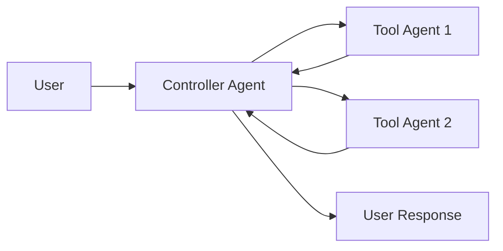

# 多智能体系统

**多智能体系统**将复杂的应用拆分成多个协同工作以解决问题的**专业化智能体**。

它不依赖于单个智能体来处理每一步，**多智能体架构**允许您将更小、更专注的智能体组合成一个协调的工作流程。

当出现以下情况时，多智能体系统非常有用：

*   单个智能体拥有**太多工具**，导致其难以决定使用哪个工具。
*   **上下文或记忆**对于单个智能体来说变得过于庞大，无法有效跟踪。
*   任务需要**专业化**（例如，一个规划者、一个研究员、一个数学专家）。

## 多智能体模式

| 模式 | 工作原理 | 控制流 | 示例用例 |
| :--- | :--- | :--- | :--- |
| **工具调用 (Tool Calling)** | 一个**主管 (supervisor)** 智能体将其他智能体作为*工具*来调用。“工具”智能体不直接与用户交谈——它们只运行任务并返回结果。 | **集中式**：所有路由都通过调用智能体进行。 | 任务编排、结构化工作流程。 |
| **交接 (Handoffs)** | 当前智能体决定将**控制权转移**给另一个智能体。活动的智能体发生变化，用户可以继续直接与新的智能体交互。 | **分散式**：智能体可以改变谁是活动的。 | 多领域对话、专家接管。 |

> 教程：构建一个主管智能体
>
> 了解如何使用主管模式构建一个个人助理，其中中央主管智能体协调专业的工人智能体。
>
> 本教程演示了：
>
> *   为不同领域（日历和电子邮件）创建专业化的子智能体
> *   将子智能体封装为工具，进行集中式编排
> *   为敏感操作添加人工审核 (human-in-the-loop review)

## 选择模式

| 问题 | 工具调用 | 交接 |
| :--- | :--- | :--- |
| 需要对工作流程进行**集中式控制**吗？ | ✅ 是 | ❌ 否 |
| 希望智能体**直接与用户交互**吗？ | ❌ 否 | ✅ 是 |
| 需要**复杂、像人一样的专家间对话**吗？ | ❌ 有限 | ✅ 强 |

> **提示：** 您可以混合使用这两种模式——使用**交接**进行智能体切换，并让每个智能体**调用子智能体作为工具**来执行专业化任务。

## 自定义智能体上下文

多智能体设计的核心是**上下文工程 (context engineering)**——决定每个智能体看到哪些信息。LangChain 允许您对以下内容进行精细控制：

*   传递给每个智能体的对话或状态的**哪些部分**。
*   为子智能体**量身定制的专业提示**。
*   包含/排除**中间推理**。
*   为每个智能体**定制输入/输出格式**。

您系统的质量**严重依赖**于上下文工程。目标是确保每个智能体都能访问执行其任务所需的**正确数据**，无论它是作为工具还是作为活动智能体。

## 工具调用 (Tool Calling)

在**工具调用**中，一个智能体（“**控制器**”）将其他智能体视为在需要时调用的*工具*。控制器管理编排，而工具智能体执行特定任务并返回结果。

**流程：**

1.  **控制器**接收输入并决定调用哪个工具（子智能体）。
2.  **工具智能体**根据控制器的指令运行其任务。
3.  **工具智能体**将结果返回给控制器。
4.  **控制器**决定下一步或完成任务。



> **提示：** 用作工具的智能体通常**不期望**继续与用户对话。
>
> 它们的角色是执行任务并将结果返回给控制器智能体。
>
> 如果您需要子智能体能够与用户对话，请改用**交接**模式。

### 实现

下面是一个最小的示例，其中主智能体通过工具定义获得了对单个子智能体的访问权限：

```python
from langchain.tools import tool
from langchain.agents import create_agent
subagent1 = create_agent(model="...", tools=[...])
@tool(
    "subagent1_name",
    description="subagent1_description"
)
def call_subagent1(query: str):
    result = subagent1.invoke({
        "messages": [{"role": "user", "content": query}]
    })
    return result["messages"][-1].content
agent = create_agent(model="...", tools=[call_subagent1])
```

在此模式中：

1.  当主智能体决定任务与子智能体的描述匹配时，它会调用 `call_subagent1`。
2.  子智能体独立运行并返回其结果。
3.  主智能体接收结果并继续编排。

### 何处自定义

有几个点可以控制主智能体与其子智能体之间上下文的传递方式：

1.  **子智能体名称** (`"subagent1_name`)：这是主智能体引用子智能体的方式。因为它会影响提示，所以请仔细选择。
2.  **子智能体描述** (`"subagent1_description`)：这是主智能体“了解”子智能体的内容。它直接决定了主智能体何时决定调用它。
3.  **对子智能体的输入**：您可以自定义此输入，以更好地塑造子智能体解释任务的方式。在上面的示例中，我们直接传递了智能体生成的 `query`。
4.  **来自子智能体的输出**：这是**返回给主智能体的响应**。您可以调整返回的内容，以控制主智能体如何解释结果。在上面的示例中，我们返回了最终消息文本，但您也可以返回额外的状态或元数据。

### 控制对子智能体的输入

控制主智能体传递给子智能体的输入有两个主要杠杆：

*   **修改提示** – 调整主智能体的提示或工具元数据（即，子智能体的名称和描述），以更好地指导其何时以及如何调用子智能体。
*   **上下文注入** – 通过调整工具调用以从智能体的状态中提取信息，来添加无法在静态提示中捕获的输入（例如，完整的消息历史记录、先前的结果、任务元数据）。

```python
from langchain.agents import AgentState
from langchain.tools import tool, ToolRuntime
class CustomState(AgentState):
    example_state_key: str
@tool(
    "subagent1_name",
    description="subagent1_description"
)
def call_subagent1(query: str, runtime: ToolRuntime[None, CustomState]):
    # 应用所需的任何逻辑，将消息转换为合适的输入
    subagent_input = some_logic(query, runtime.state["messages"])
    result = subagent1.invoke({
        "messages": subagent_input,
        # 您也可以根据需要在此处传递其他状态键。
        # 确保在主智能体和子智能体的状态模式中都定义了这些键。
        "example_state_key": runtime.state["example_state_key"]
    })
    return result["messages"][-1].content
```

### 控制来自子智能体的输出

塑造主智能体从子智能体接收回的内容的两个常见策略：

*   **修改提示** – 优化子智能体的提示，以**准确指定应返回什么**。
    *   当输出不完整、过于冗长或缺少关键细节时很有用。
    *   一个常见的失败模式是子智能体执行了工具调用或推理，但**没有将结果包含在最终消息中**。提醒它控制器（和用户）只能看到最终输出，因此所有相关信息都必须包含在其中。
*   **自定义输出格式化** – 在将子智能体的响应返回给主智能体之前，在代码中对其进行调整或丰富。
    *   示例：除了最终文本之外，将特定的状态键传递回主智能体。
    *   这需要将结果包装在一个 [`Command`](https://langchain-doc.cn/v1/python/langgraph/types/#langgraph.types.Command)（或等效结构）中，以便您可以将自定义状态与子智能体的响应合并。

```python
from typing import Annotated
from langchain.agents import AgentState
from langchain.tools import InjectedToolCallId
from langgraph.types import Command
@tool(
    "subagent1_name",
    description="subagent1_description"
)
# 我们需要将 `tool_call_id` 传递给子智能体，以便它可以使用它来响应工具调用结果
def call_subagent1(
    query: str,
    tool_call_id: Annotated[str, InjectedToolCallId],
# 您需要返回一个 `Command` 对象，才能包含除最终工具调用之外的更多内容
) -> Command:
    result = subagent1.invoke({
        "messages": [{"role": "user", "content": query}]
    })
    return Command(update={
        # 这是我们传回的示例状态键
        "example_state_key": result["example_state_key"],
        "messages": [
            ToolMessage(
                content=result["messages"][-1].content,
                # 我们需要包含工具调用 ID，以便它与正确的工具调用匹配
                tool_call_id=tool_call_id
            )
        ]
    })
```

## 交接 (Handoffs)

在**交接**中，智能体可以直接将控制权相互传递。“活动”智能体发生变化，用户与当前拥有控制权的智能体进行交互。

**流程：**

1.  **当前智能体**决定它需要另一个智能体的帮助。
2.  它将控制权（和状态）传递给**下一个智能体**。
3.  **新的智能体**直接与用户交互，直到它决定再次交接或完成。

```mermaid
graph LR
    A[User] --> B[Agent A]
    B --> C[Agent B]
    C --> A