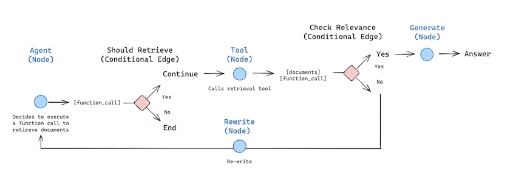
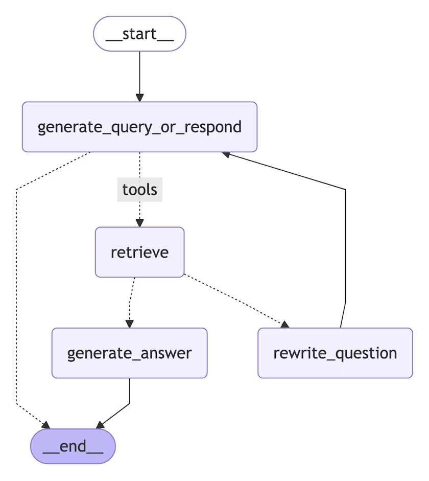

# 构建自定义 RAG 代理

在本教程中，我们将使用 LangGraph 构建一个[检索](../langchain/retrieval.html)代理。

LangChain 提供了内置的[代理](../langchain/agents.html)实现，这些实现使用[LangGraph](overview.html)原语。如果需要更深入的自定义，可以直接在 LangGraph 中实现代理。本指南展示了检索代理的示例实现。[检索](../langchain/retrieval.html)代理在您希望 LLM 决定是从向量存储中检索上下文还是直接响应用户时非常有用。

在本教程结束时，我们将完成以下工作：

1. 获取并预处理将用于检索的文档。
2. 为语义搜索索引这些文档，并为代理创建检索工具。
3. 构建一个能够决定何时使用检索工具的代理 RAG 系统。



### 概念

我们将涵盖以下概念：

- 使用[文档加载器](https://langchain-doc.cn/v1/python/integrations/document_loaders)、[文本分割器](https://langchain-doc.cn/v1/python/integrations/splitters)、[嵌入](https://langchain-doc.cn/v1/python/integrations/text_embedding)和[向量存储](https://langchain-doc.cn/v1/python/integrations/vectorstores)进行[检索](../langchain/retrieval.html)
- LangGraph [Graph API](https://langchain-doc.cn/v1/python/langgraph/graph-api)，包括状态、节点、边和条件边。

## 设置

让我们下载所需的包并设置 API 密钥：

```python
pip install -U langgraph "langchain[openai]" langchain-community langchain-text-splitters bs4
```

```python
import getpass
import os
def _set_env(key: str):
    if key not in os.environ:
        os.environ[key] = getpass.getpass(f"{key}:")
_set_env("OPENAI_API_KEY")
```

```bash
# npm
npm install @langchain/langgraph @langchain/openai @langchain/community @langchain/textsplitters
# pnpm
pnpm install @langchain/langgraph @langchain/openai @langchain/community @langchain/textsplitters
# yarn
yarn add @langchain/langgraph @langchain/openai @langchain/community @langchain/textsplitters
# bun
bun add @langchain/langgraph @langchain/openai @langchain/community @langchain/textsplitters
```

提示：注册 LangSmith 以快速发现问题并提高 LangGraph 项目的性能。[LangSmith](https://docs.smith.langchain.com) 让您使用跟踪数据调试、测试和监控使用 LangGraph 构建的 LLM 应用程序。

## 1. 预处理文档

### Python

1. 获取用于我们的 RAG 系统的文档。我们将使用 [Lilian Weng 的优秀博客](https://lilianweng.github.io/)中的三个最新页面。我们将首先使用 `WebBaseLoader` 工具获取页面内容：

```python
from langchain_community.document_loaders import WebBaseLoader
urls = [
    "https://lilianweng.github.io/posts/2024-11-28-reward-hacking/",
    "https://lilianweng.github.io/posts/2024-07-07-hallucination/",
    "https://lilianweng.github.io/posts/2024-04-12-diffusion-video/",
]
docs = [WebBaseLoader(url).load() for url in urls]
```

```python
docs[0][0].page_content.strip()[:1000]
```

2. 将获取的文档分割成更小的块，以便索引到我们的向量存储中：

```python
from langchain_text_splitters import RecursiveCharacterTextSplitter
docs_list = [item for sublist in docs for item in sublist]
text_splitter = RecursiveCharacterTextSplitter.from_tiktoken_encoder(
    chunk_size=100, chunk_overlap=50
)
doc_splits = text_splitter.split_documents(docs_list)
```

```python
doc_splits[0].page_content.strip()
```

### JavaScript

1. 获取用于我们的 RAG 系统的文档。我们将使用 [Lilian Weng 的优秀博客](https://lilianweng.github.io/)中的三个最新页面。我们将首先使用 `CheerioWebBaseLoader` 获取页面内容：

```typescript
import { CheerioWebBaseLoader } from "@langchain/community/document_loaders/web/cheerio";
const urls = [
  "https://lilianweng.github.io/posts/2023-06-23-agent/",
  "https://lilianweng.github.io/posts/2023-03-15-prompt-engineering/",
  "https://lilianweng.github.io/posts/2023-10-25-adv-attack-llm/",
];
const docs = await Promise.all(
  urls.map((url) => new CheerioWebBaseLoader(url).load()),
);
```

2. 将获取的文档分割成更小的块，以便索引到我们的向量存储中：

```typescript
import { RecursiveCharacterTextSplitter } from "@langchain/textsplitters";
const docsList = docs.flat();
const textSplitter = new RecursiveCharacterTextSplitter({
  chunkSize: 500,
  chunkOverlap: 50,
});
const docSplits = await textSplitter.splitDocuments(docsList);
```

## 2. 创建检索工具

现在我们有了分割好的文档，我们可以将它们索引到向量存储中，用于语义搜索。

### Python

1. 使用内存向量存储和 OpenAI 嵌入：

```python
from langchain_core.vectorstores import InMemoryVectorStore
from langchain_openai import OpenAIEmbeddings
vectorstore = InMemoryVectorStore.from_documents(
    documents=doc_splits, embedding=OpenAIEmbeddings()
)
retriever = vectorstore.as_retriever()
```

2. 使用 LangChain 的预构建 `create_retriever_tool` 创建检索工具：

```python
from langchain_classic.tools.retriever import create_retriever_tool
retriever_tool = create_retriever_tool(
    retriever,
    "retrieve_blog_posts",
    "Search and return information about Lilian Weng blog posts.",
)
```

3. 测试工具：

```python
retriever_tool.invoke({"query": "types of reward hacking"})
```

### JavaScript

1. 使用内存向量存储和 OpenAI 嵌入：

```typescript
import { MemoryVectorStore } from "@langchain/classic/vectorstores/memory";
import { OpenAIEmbeddings } from "@langchain/openai";
const vectorStore = await MemoryVectorStore.fromDocuments(
  docSplits,
  new OpenAIEmbeddings(),
);
const retriever = vectorStore.asRetriever();
```

2. 使用 LangChain 的预构建 `createRetrieverTool` 创建检索工具：

```typescript
import { createRetrieverTool } from "@langchain/classic/tools/retriever";
const tool = createRetrieverTool(
  retriever,
  {
    name: "retrieve_blog_posts",
    description:
      "Search and return information about Lilian Weng blog posts on LLM agents, prompt engineering, and adversarial attacks on LLMs.",
  },
);
const tools = [tool];
```

## 3. 生成查询

现在我们将开始构建代理 RAG 图的组件（[节点](https://langchain-doc.cn/v1/python/langgraph/graph-api#nodes)和[边](https://langchain-doc.cn/v1/python/langgraph/graph-api#edges)）。

### Python

注意，这些组件将在 [MessagesState](https://langchain-doc.cn/v1/python/langgraph/graph-api#messagesstate) 上运行 - 图状态包含一个带有[聊天消息](https://python.langchain.com/docs/concepts/messages/)列表的 `messages` 键。

1. 构建一个 `generate_query_or_respond` 节点。它将调用 LLM 基于当前图状态（消息列表）生成响应。给定输入消息，它将决定使用检索工具进行检索，或者直接响应用户。注意，我们通过 `.bind_tools` 给聊天模型提供了我们之前创建的 `retriever_tool` 访问权限：

```python
from langgraph.graph import MessagesState
from langchain.chat_models import init_chat_model
response_model = init_chat_model("gpt-4o", temperature=0)
def generate_query_or_respond(state: MessagesState):
    """Call the model to generate a response based on the current state. Given
    the question, it will decide to retrieve using the retriever tool, or simply respond to the user.
    """
    response = (
        response_model
        .bind_tools([retriever_tool]).invoke(state["messages"])  
    )
    return {"messages": [response]}
```

2. 在随机输入上尝试：

```python
input = {"messages": [{"role": "user", "content": "hello!"}]}
generate_query_or_respond(input)["messages"][-1].pretty_print()
```

**输出：**

```
================================== Ai Message ==================================
Hello! How can I help you today?
```

3. 问一个需要语义搜索的问题：

```python
input = {
    "messages": [
        {
            "role": "user",
            "content": "What does Lilian Weng say about types of reward hacking?",
        }
    ]
}
generate_query_or_respond(input)["messages"][-1].pretty_print()
```

**输出：**

```
================================== Ai Message ==================================
Tool Calls:
retrieve_blog_posts (call_tYQxgfIlnQUDMdtAhdbXNwIM)
Call ID: call_tYQxgfIlnQUDMdtAhdbXNwIM
Args:
    query: types of reward hacking
```

### JavaScript

1. 构建一个 `generateQueryOrRespond` 节点。它将调用 LLM 基于当前图状态（消息列表）生成响应。给定输入消息，它将决定使用检索工具进行检索，或者直接响应用户。注意，我们通过 `.bindTools` 给聊天模型提供了我们之前创建的 `tools` 访问权限：

```typescript
import { ChatOpenAI } from "@langchain/openai";
async function generateQueryOrRespond(state) {
  const { messages } = state;
  const model = new ChatOpenAI({
    model: "gpt-4o",
    temperature: 0,
  }).bindTools(tools);  
  const response = await model.invoke(messages);
  return {
    messages: [response],
  };
}
```

2. 在随机输入上尝试：

```typescript
import { HumanMessage } from "@langchain/core/messages";
const input = { messages: [new HumanMessage("hello!")] };
const result = await generateQueryOrRespond(input);
console.log(result.messages[0]);
```

**输出：**

```
AIMessage {
  content: "Hello! How can I help you today?",
  tool_calls: []
}
```

3. 问一个需要语义搜索的问题：

```typescript
const input = {
  messages: [
    new HumanMessage("What does Lilian Weng say about types of reward hacking?")
  ]
};
const result = await generateQueryOrRespond(input);
console.log(result.messages[0]);
```

**输出：**

```
AIMessage {
  content: "",
  tool_calls: [
    {
      name: "retrieve_blog_posts",
      args: { query: "types of reward hacking" },
      id: "call_...",
      type: "tool_call"
    }
  ]
}
```

## 4. 评估文档

### Python

1. 添加一个[条件边](https://langchain-doc.cn/v1/python/langgraph/graph-api#conditional-edges) — `grade_documents` — 以确定检索到的文档是否与问题相关。我们将使用带有结构化输出模式 `GradeDocuments` 的模型进行文档评估。`grade_documents` 函数将根据评估决策返回要转到的节点名称（`generate_answer` 或 `rewrite_question`）：

```python
from pydantic import BaseModel, Field
from typing import Literal
GRADE_PROMPT = (
    "You are a grader assessing relevance of a retrieved document to a user question. \n "
    "Here is the retrieved document: \n\n {context} \n\n"
    "Here is the user question: {question} \n"
    "If the document contains keyword(s) or semantic meaning related to the user question, grade it as relevant. \n"
    "Give a binary score 'yes' or 'no' score to indicate whether the document is relevant to the question."
)
class GradeDocuments(BaseModel):  
    """Grade documents using a binary score for relevance check."""
    binary_score: str = Field(
        description="Relevance score: 'yes' if relevant, or 'no' if not relevant"
    )
grader_model = init_chat_model("gpt-4o", temperature=0)
def grade_documents(
    state: MessagesState,
) -> Literal["generate_answer", "rewrite_question"]:
    """Determine whether the retrieved documents are relevant to the question."""
    question = state["messages"][0].content
    context = state["messages"][-1].content
    prompt = GRADE_PROMPT.format(question=question, context=context)
    response = (
        grader_model
        .with_structured_output(GradeDocuments).invoke(  
            [{"role": "user", "content": prompt}]
        )
    )
    score = response.binary_score
    if score == "yes":
        return "generate_answer"
    else:
        return "rewrite_question"
```

2. 使用工具响应中的不相关文档运行此操作：

```python
from langchain_core.messages import convert_to_messages
input = {
    "messages": convert_to_messages(
        [
            {
                "role": "user",
                "content": "What does Lilian Weng say about types of reward hacking?",
            },
            {
                "role": "assistant",
                "content": "",
                "tool_calls": [
                    {
                        "id": "1",
                        "name": "retrieve_blog_posts",
                        "args": {"query": "types of reward hacking"},
                    }
                ],
            },
            {"role": "tool", "content": "meow", "tool_call_id": "1"},
        ]
    )
}
grade_documents(input)
```

3. 确认相关文档被正确分类：

```python
input = {
    "messages": convert_to_messages(
        [
            {
                "role": "user",
                "content": "What does Lilian Weng say about types of reward hacking?",
            },
            {
                "role": "assistant",
                "content": "",
                "tool_calls": [
                    {
                        "id": "1",
                        "name": "retrieve_blog_posts",
                        "args": {"query": "types of reward hacking"},
                    }
                ],
            },
            {
                "role": "tool",
                "content": "reward hacking can be categorized into two types: environment or goal misspecification, and reward tampering",
                "tool_call_id": "1",
            },
        ]
    )
}
grade_documents(input)
```

### JavaScript

1. 添加一个节点 — `gradeDocuments` — 以确定检索到的文档是否与问题相关。我们将使用带有结构化输出的模型（使用 Zod）进行文档评估。我们还将添加一个[条件边](https://langchain-doc.cn/v1/python/langgraph/graph-api#conditional-edges) — `checkRelevance` — 检查评估结果并返回要转到的节点名称（`generate` 或 `rewrite`）：

```typescript
import * as z from "zod";
import { ChatPromptTemplate } from "@langchain/core/prompts";
import { ChatOpenAI } from "@langchain/openai";
import { AIMessage } from "@langchain/core/messages";
const prompt = ChatPromptTemplate.fromTemplate(
  `You are a grader assessing relevance of retrieved docs to a user question.
  Here are the retrieved docs:
  \n ------- \n
  {context}
  \n ------- \n
  Here is the user question: {question}
  If the content of the docs are relevant to the users question, score them as relevant.
  Give a binary score 'yes' or 'no' score to indicate whether the docs are relevant to the question.
  Yes: The docs are relevant to the question.
  No: The docs are not relevant to the question.`,
);
const gradeDocumentsSchema = z.object({
  binaryScore: z.string().describe("Relevance score 'yes' or 'no'"),  
})
async function gradeDocuments(state) {
  const { messages } = state;
  const model = new ChatOpenAI({
    model: "gpt-4o",
    temperature: 0,
  }).withStructuredOutput(gradeDocumentsSchema);
  const score = await prompt.pipe(model).invoke({
    question: messages.at(0)?.content,
    context: messages.at(-1)?.content,
  });
  if (score.binaryScore === "yes") {
    return "generate";
  }
  return "rewrite";
}
```

2. 使用工具响应中的不相关文档运行此操作：

```typescript
import { ToolMessage } from "@langchain/core/messages";
const input = {
  messages: [
      new HumanMessage("What does Lilian Weng say about types of reward hacking?"),
      new AIMessage({
          tool_calls: [
              {
                  type: "tool_call",
                  name: "retrieve_blog_posts",
                  args: { query: "types of reward hacking" },
                  id: "1",
              }
          ]
      }),
      new ToolMessage({
          content: "meow",
          tool_call_id: "1",
      })
  ]
}
const result = await gradeDocuments(input);
```

3. 确认相关文档被正确分类：

```typescript
const input = {
  messages: [
      new HumanMessage("What does Lilian Weng say about types of reward hacking?"),
      new AIMessage({
          tool_calls: [
              {
                  type: "tool_call",
                  name: "retrieve_blog_posts",
                  args: { query: "types of reward hacking" },
                  id: "1",
              }
          ]
      }),
      new ToolMessage({
          content: "reward hacking can be categorized into two types: environment or goal misspecification, and reward tampering",
          tool_call_id: "1",
      })
  ]
}
const result = await gradeDocuments(input);
```

## 5. 重写问题

### Python

1. 构建 `rewrite_question` 节点。检索工具可能会返回不相关的文档，这表明需要改进原始用户问题。为此，我们将调用 `rewrite_question` 节点：

```python
REWRITE_PROMPT = (
    "Look at the input and try to reason about the underlying semantic intent / meaning.\n"
    "Here is the initial question:"
    "\n ------- \n"
    "{question}"
    "\n ------- \n"
    "Formulate an improved question:"
)
def rewrite_question(state: MessagesState):
    """Rewrite the original user question."""
    messages = state["messages"]
    question = messages[0].content
    prompt = REWRITE_PROMPT.format(question=question)
    response = response_model.invoke([{"role": "user", "content": prompt}])
    return {"messages": [{"role": "user", "content": response.content}]}
```

2. 尝试一下：

```python
input = {
    "messages": convert_to_messages(
        [
            {
                "role": "user",
                "content": "What does Lilian Weng say about types of reward hacking?",
            },
            {
                "role": "assistant",
                "content": "",
                "tool_calls": [
                    {
                        "id": "1",
                        "name": "retrieve_blog_posts",
                        "args": {"query": "types of reward hacking"},
                    }
                ],
            },
            {"role": "tool", "content": "meow", "tool_call_id": "1"},
        ]
    )
}
response = rewrite_question(input)
print(response["messages"][-1]["content"])
```

**输出：**

```
What are the different types of reward hacking described by Lilian Weng, and how does she explain them?
```

### JavaScript

1. 构建 `rewrite` 节点。检索工具可能会返回不相关的文档，这表明需要改进原始用户问题。为此，我们将调用 `rewrite` 节点：

```typescript
import { ChatPromptTemplate } from "@langchain/core/prompts";
import { ChatOpenAI } from "@langchain/openai";
const rewritePrompt = ChatPromptTemplate.fromTemplate(
  `Look at the input and try to reason about the underlying semantic intent / meaning. \n
  Here is the initial question:
  \n ------- \n
  {question}
  \n ------- \n
  Formulate an improved question:`,
);
async function rewrite(state) {
  const { messages } = state;
  const question = messages.at(0)?.content;
  const model = new ChatOpenAI({
    model: "gpt-4o",
    temperature: 0,
  });
  const response = await rewritePrompt.pipe(model).invoke({ question });
  return {
    messages: [response],
  };
}
```

2. 尝试一下：

```typescript
import { HumanMessage, AIMessage, ToolMessage } from "@langchain/core/messages";
const input = {
  messages: [
    new HumanMessage("What does Lilian Weng say about types of reward hacking?"),
    new AIMessage({
      content: "",
      tool_calls: [
        {
          id: "1",
          name: "retrieve_blog_posts",
          args: { query: "types of reward hacking" },
          type: "tool_call"
        }
      ]
    }),
    new ToolMessage({ content: "meow", tool_call_id: "1" })
  ]
};
const response = await rewrite(input);
console.log(response.messages[0].content);
```

**输出：**

```
What are the different types of reward hacking described by Lilian Weng, and how does she explain them?
```

## 6. 生成答案

### Python

1. 构建 `generate_answer` 节点：如果我们通过了评估检查，我们可以根据原始问题和检索到的上下文生成最终答案：

```python
GENERATE_PROMPT = (
    "You are an assistant for question-answering tasks. "
    "Use the following pieces of retrieved context to answer the question. "
    "If you don't know the answer, just say that you don't know. "
    "Use three sentences maximum and keep the answer concise.\n"
    "Question: {question} \n"
    "Context: {context}"
)
def generate_answer(state: MessagesState):
    """Generate an answer."""
    question = state["messages"][0].content
    context = state["messages"][-1].content
    prompt = GENERATE_PROMPT.format(question=question, context=context)
    response = response_model.invoke([{"role": "user", "content": prompt}])
    return {"messages": [response]}
```

2. 尝试一下：

```python
input = {
    "messages": convert_to_messages(
        [
            {
                "role": "user",
                "content": "What does Lilian Weng say about types of reward hacking?",
            },
            {
                "role": "assistant",
                "content": "",
                "tool_calls": [
                    {
                        "id": "1",
                        "name": "retrieve_blog_posts",
                        "args": {"query": "types of reward hacking"},
                    }
                ],
            },
            {
                "role": "tool",
                "content": "reward hacking can be categorized into two types: environment or goal misspecification, and reward tampering",
                "tool_call_id": "1",
            },
        ]
    )
}
response = generate_answer(input)
response["messages"][-1].pretty_print()
```

**输出：**

```
================================== Ai Message ==================================
Lilian Weng categorizes reward hacking into two types: environment or goal misspecification, and reward tampering. She considers reward hacking as a broad concept that includes both of these categories. Reward hacking occurs when an agent exploits flaws or ambiguities in the reward function to achieve high rewards without performing the intended behaviors.
```

### JavaScript

1. 构建 `generate` 节点：如果我们通过了评估检查，我们可以根据原始问题和检索到的上下文生成最终答案：

```typescript
import { ChatPromptTemplate } from "@langchain/core/prompts";
import { ChatOpenAI } from "@langchain/openai";
async function generate(state) {
  const { messages } = state;
  const question = messages.at(0)?.content;
  const context = messages.at(-1)?.content;
  const prompt = ChatPromptTemplate.fromTemplate(
  `You are an assistant for question-answering tasks.
      Use the following pieces of retrieved context to answer the question.
      If you don't know the answer, just say that you don't know.
      Use three sentences maximum and keep the answer concise.
      Question: {question}
      Context: {context}`
  );
  const llm = new ChatOpenAI({
    model: "gpt-4o",
    temperature: 0,
  });
  const ragChain = prompt.pipe(llm);
  const response = await ragChain.invoke({
    context,
    question,
  });
  return {
    messages: [response],
  };
}
```

2. 尝试一下：

```typescript
import { HumanMessage, AIMessage, ToolMessage } from "@langchain/core/messages";
const input = {
  messages: [
    new HumanMessage("What does Lilian Weng say about types of reward hacking?"),
    new AIMessage({
      content: "",
      tool_calls: [
        {
          id: "1",
          name: "retrieve_blog_posts",
          args: { query: "types of reward hacking" },
          type: "tool_call"
        }
      ]
    }),
    new ToolMessage({
      content: "reward hacking can be categorized into two types: environment or goal misspecification, and reward tampering",
      tool_call_id: "1"
    })
  ]
};
const response = await generate(input);
console.log(response.messages[0].content);
```

**输出：**

```
Lilian Weng categorizes reward hacking into two types: environment or goal misspecification, and reward tampering. She considers reward hacking as a broad concept that includes both of these categories. Reward hacking occurs when an agent exploits flaws or ambiguities in the reward function to achieve high rewards without performing the intended behaviors.
```

## 7. 组装图

现在我们将所有节点和边组装成一个完整的图：

### Python

- 从 `generate_query_or_respond` 开始，确定是否需要调用 `retriever_tool`
- 使用 `tools_condition` 路由到下一步：
  - 如果 `generate_query_or_respond` 返回了 `tool_calls`，调用 `retriever_tool` 检索上下文
  - 否则，直接响应用户
- 评估检索到的文档内容与问题的相关性（`grade_documents`）并路由到下一步：
  - 如果不相关，使用 `rewrite_question` 重写问题，然后再次调用 `generate_query_or_respond`
  - 如果相关，继续执行 `generate_answer`，使用带有检索文档上下文的 @[`ToolMessage`] 生成最终响应

```python
from langgraph.graph import StateGraph, START, END
from langgraph.prebuilt import ToolNode, tools_condition
workflow = StateGraph(MessagesState)
# 定义我们将在之间循环的节点
workflow.add_node(generate_query_or_respond)
workflow.add_node("retrieve", ToolNode([retriever_tool]))
workflow.add_node(rewrite_question)
workflow.add_node(generate_answer)
workflow.add_edge(START, "generate_query_or_respond")
# 决定是否检索
workflow.add_conditional_edges(
    "generate_query_or_respond",
    # 评估 LLM 决策（调用 `retriever_tool` 工具或响应用户）
    tools_condition,
    {
        # 将条件输出转换为图中的节点
        "tools": "retrieve",
        END: END,
    },
)
# 在调用 `action` 节点后采取的边。
workflow.add_conditional_edges(
    "retrieve",
    # 评估代理决策
    grade_documents,
)
workflow.add_edge("generate_answer", END)
workflow.add_edge("rewrite_question", "generate_query_or_respond")
# 编译
graph = workflow.compile()
```

可视化图：

```python
from IPython.display import Image, display
display(Image(graph.get_graph().draw_mermaid_png()))
```



### JavaScript

- 从 `generateQueryOrRespond` 开始，确定是否需要调用检索工具
- 使用条件边路由到下一步：
  - 如果 `generateQueryOrRespond` 返回了 `tool_calls`，调用检索工具检索上下文
  - 否则，直接响应用户
- 评估检索到的文档内容与问题的相关性（`gradeDocuments`）并路由到下一步：
  - 如果不相关，使用 `rewrite` 重写问题，然后再次调用 `generateQueryOrRespond`
  - 如果相关，继续执行 `generate`，使用带有检索文档上下文的 @[`ToolMessage`] 生成最终响应

```typescript
import { StateGraph, START, END } from "@langchain/langgraph";
import { ToolNode } from "@langchain/langgraph/prebuilt";
import { AIMessage } from "langchain";
// 为检索器创建一个 ToolNode
const toolNode = new ToolNode(tools);
// 确定是否应该检索的辅助函数
function shouldRetrieve(state) {
  const { messages } = state;
  const lastMessage = messages.at(-1);
  if (AIMessage.isInstance(lastMessage) && lastMessage.tool_calls.length) {
    return "retrieve";
  }
  return END;
}
// 定义图
const builder = new StateGraph(GraphState)
  .addNode("generateQueryOrRespond", generateQueryOrRespond)
  .addNode("retrieve", toolNode)
  .addNode("gradeDocuments", gradeDocuments)
  .addNode("rewrite", rewrite)
  .addNode("generate", generate)
  // 添加边
  .addEdge(START, "generateQueryOrRespond")
  // 决定是否检索
  .addConditionalEdges("generateQueryOrRespond", shouldRetrieve)
  .addEdge("retrieve", "gradeDocuments")
  // 评估文档后采取的边
  .addConditionalEdges(
    "gradeDocuments",
    // 基于评估决策路由
    (state) => {
      // gradeDocuments 函数返回 "generate" 或 "rewrite"
      const lastMessage = state.messages.at(-1);
      return lastMessage.content === "generate" ? "generate" : "rewrite";
    }
  )
  .addEdge("generate", END)
  .addEdge("rewrite", "generateQueryOrRespond");
// 编译
const graph = builder.compile();
```

## 8. 运行代理 RAG

现在让我们通过用问题运行完整的图来测试它：

### Python

```python
for chunk in graph.stream(
    {
        "messages": [
            {
                "role": "user",
                "content": "What does Lilian Weng say about types of reward hacking?",
            }
        ]
    }
):
    for node, update in chunk.items():
        print("Update from node", node)
        update["messages"][-1].pretty_print()
        print("\n\n")
```

**输出：**

```
Update from node generate_query_or_respond
================================== Ai Message ==================================
Tool Calls:
  retrieve_blog_posts (call_NYu2vq4km9nNNEFqJwefWKu1)
 Call ID: call_NYu2vq4km9nNNEFqJwefWKu1
  Args:
    query: types of reward hacking
Update from node retrieve
================================= Tool Message ==================================
Name: retrieve_blog_posts
(Note: Some work defines reward tampering as a distinct category of misalignment behavior from reward hacking. But I consider reward hacking as a broader concept here.)
At a high level, reward hacking can be categorized into two types: environment or goal misspecification, and reward tampering.
Why does Reward Hacking Exist?#
Pan et al. (2022) investigated reward hacking as a function of agent capabilities, including (1) model size, (2) action space resolution, (3) observation space noise, and (4) training time. They also proposed a taxonomy of three types of misspecified proxy rewards:
Let's Define Reward Hacking#
Reward shaping in RL is challenging. Reward hacking occurs when an RL agent exploits flaws or ambiguities in the reward function to obtain high rewards without genuinely learning the intended behaviors or completing the task as designed. In recent years, several related concepts have been proposed, all referring to some form of reward hacking:
Update from node generate_answer
================================== Ai Message ==================================
Lilian Weng categorizes reward hacking into two types: environment or goal misspecification, and reward tampering. She considers reward hacking as a broad concept that includes both of these categories. Reward hacking occurs when an agent exploits flaws or ambiguities in the reward function to achieve high rewards without performing the intended behaviors.
```

### JavaScript

```typescript
import { HumanMessage } from "@langchain/core/messages";
const inputs = {
  messages: [
    new HumanMessage("What does Lilian Weng say about types of reward hacking?")
  ]
};
for await (const output of await graph.stream(inputs)) {
  for (const [key, value] of Object.entries(output)) {
    const lastMsg = output[key].messages[output[key].messages.length - 1];
    console.log(`Output from node: '${key}'`);
    console.log({
      type: lastMsg._getType(),
      content: lastMsg.content,
      tool_calls: lastMsg.tool_calls,
    });
    console.log("---\n");
  }
}
```

**输出：**

```
Output from node: 'generateQueryOrRespond'
{
  type: 'ai',
  content: '',
  tool_calls: [
    {
      name: 'retrieve_blog_posts',
      args: { query: 'types of reward hacking' },
      id: 'call_...',
      type: 'tool_call'
    }
  ]
}
---
Output from node: 'retrieve'
{
  type: 'tool',
  content: '(Note: Some work defines reward tampering as a distinct category...\n' +
    'At a high level, reward hacking can be categorized into two types: environment or goal misspecification, and reward tampering.\n' +
    '...',
  tool_calls: undefined
}
---
Output from node: 'generate'
{
  type: 'ai',
  content: 'Lilian Weng categorizes reward hacking into two types: environment or goal misspecification, and reward tampering. She considers reward hacking as a broad concept that includes both of these categories. Reward hacking occurs when an agent exploits flaws or ambiguities in the reward function to achieve high rewards without performing the intended behaviors.',
  tool_calls: []
}
---