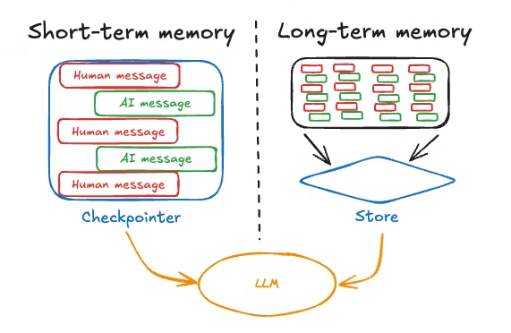
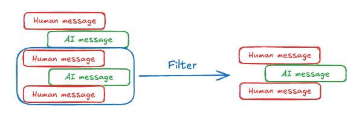
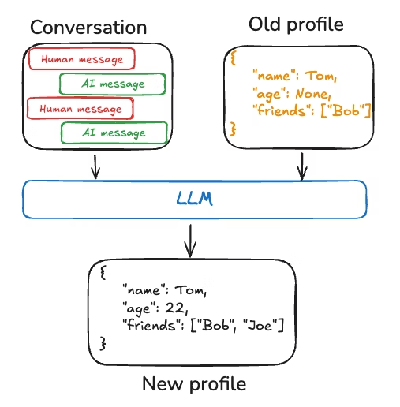
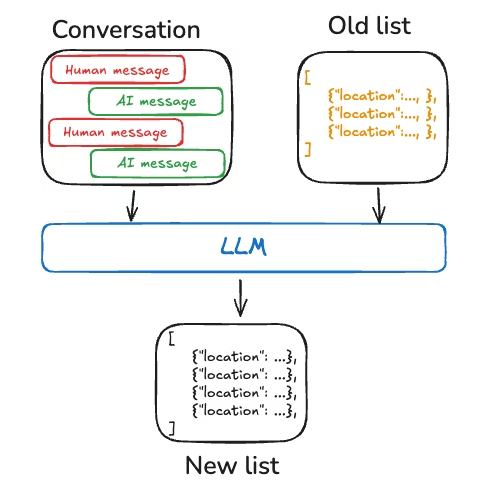
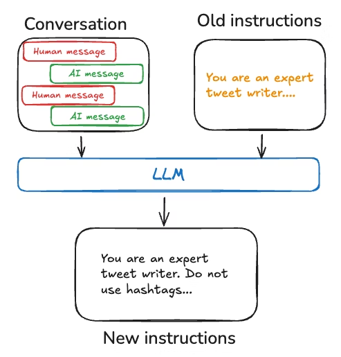
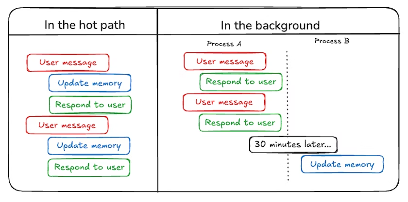

# 记忆概述

[记忆](add-memory.html)是一个记住关于先前交互信息的系统。对于AI代理来说，记忆至关重要，因为它使它们能够记住先前的交互，从反馈中学习，并适应用户偏好。随着代理处理更多具有大量用户交互的复杂任务，这种能力对于效率和用户满意度都变得至关重要。

本概念指南涵盖两种类型的记忆，基于它们的回忆范围：

*   [短期记忆](memory.html#短期记忆)，或[线程](persistence.html#threads)范围的记忆，通过维护会话中的消息历史来跟踪正在进行的对话。LangGraph将短期记忆作为代理[状态](https://langchain-doc.cn/v1/python/langgraph/graph-api#state)的一部分进行管理。状态通过[checkpointer](persistence.html#checkpoints)持久化到数据库，因此线程可以随时恢复。短期记忆在图形被调用或步骤完成时更新，并且在每个步骤开始时读取状态。
*   [长期记忆](memory.html#长期记忆)存储跨会话的用户特定或应用程序级数据，并在会话线程之间共享。它可以在任何时间和任何线程中被调用。记忆的范围不限于单个线程ID，而是可以自定义命名空间。LangGraph提供[存储](persistence.html#memory-store)（[参考文档](https://langchain-ai.github.io/langgraph/reference/store/#langgraph.store.base.BaseStore)）让您保存和调用长期记忆。



## 短期记忆

[短期记忆](add-memory.html#add-short-term-memory)让您的应用程序记住单个[线程](persistence.html#threads)或对话中的先前交互。[线程](persistence.html#threads)组织会话中的多个交互，类似于电子邮件在单个对话中组织消息的方式。

LangGraph将短期记忆作为代理状态的一部分进行管理，通过线程范围的检查点持久化。这种状态通常可以包括对话历史以及其他有状态数据，例如上传的文件、检索的文档或生成的工件。通过将这些存储在图形的状态中，机器人可以访问给定对话的完整上下文，同时保持不同线程之间的分离。

### 管理短期记忆

对话历史是最常见的短期记忆形式，而长对话对当今的LLM提出了挑战。完整的历史可能无法容纳在LLM的上下文窗口中，导致不可恢复的错误。即使您的LLM支持完整的上下文长度，大多数LLM在长上下文中的表现仍然很差。它们会被过时或偏离主题的内容"分散注意力"，同时还会遭受较慢的响应时间和更高的成本。

聊天模型使用消息接受上下文，包括开发人员提供的指令（系统消息）和用户输入（人类消息）。在聊天应用程序中，消息在人类输入和模型响应之间交替，导致消息列表随着时间的推移变得更长。由于上下文窗口有限且富含token的消息列表可能成本高昂，许多应用程序可以受益于使用手动删除或忘记过时信息的技术。



有关管理消息的常见技术的更多信息，请参阅[添加和管理记忆](add-memory.html#manage-short-term-memory)指南。

## 长期记忆

LangGraph中的[长期记忆](add-memory.html#add-long-term-memory)允许系统在不同的对话或会话中保留信息。与**线程范围的**短期记忆不同，长期记忆保存在自定义的"命名空间"中。

长期记忆是一个复杂的挑战，没有一刀切的解决方案。然而，以下问题提供了一个框架来帮助您浏览不同的技术：

*   记忆的类型是什么？人类使用记忆来记住事实（[语义记忆](memory.html#语义记忆)）、经历（[情景记忆](memory.html#情景记忆)）和规则（[程序记忆](memory.html#程序记忆)）。AI代理可以以相同的方式使用记忆。例如，AI代理可以使用记忆来记住关于用户的特定事实以完成任务。
*   [您想何时更新记忆？](memory.html#写入记忆)记忆可以作为代理应用程序逻辑的一部分进行更新（例如，"在热路径上"）。在这种情况下，代理通常决定在响应用户之前记住事实。或者，记忆可以作为后台任务更新（在后台/异步运行并生成记忆的逻辑）。我们在下面的[部分](memory.html#写入记忆)中解释了这些方法之间的权衡。

不同的应用程序需要各种类型的记忆。虽然类比并不完美，但研究[人类记忆类型](https://www.psychologytoday.com/us/basics/memory/types-of-memory?ref=blog.langchain.dev)可能会有启发。一些研究（例如，[CoALA论文](https://arxiv.org/pdf/2309.02427)）甚至将这些人类记忆类型映射到AI代理中使用的记忆类型。

| 记忆类型 | 存储内容 | 人类示例 | 代理示例 |
| :--- | :--- | :--- | :--- |
| [语义](memory.html#语义记忆) | 事实 | 我在学校学到的东西 | 关于用户的事实 |
| [情景](memory.html#情景记忆) | 经历 | 我做过的事情 | 过去的代理行动 |
| [程序](memory.html#程序记忆) | 指令 | 本能或运动技能 | 代理系统提示 |

### 语义记忆

[语义记忆](https://en.wikipedia.org/wiki/Semantic_memory)，无论是在人类还是AI代理中，都涉及特定事实和概念的保留。在人类中，它可以包括在学校学到的信息以及对概念及其关系的理解。对于AI代理，语义记忆通常用于通过记住过去交互中的事实或概念来个性化应用程序。

**注意：**
语义记忆与"语义搜索"不同，后者是一种使用"含义"（通常作为嵌入）查找相似内容的技术。语义记忆是来自心理学的术语，指存储事实和知识，而语义搜索是一种基于含义而非精确匹配检索信息的方法。

#### 配置文件

语义记忆可以以不同的方式管理。例如，记忆可以是一个单一的、不断更新的"配置文件"，包含有关用户、组织或其他实体（包括代理本身）的范围良好且特定的信息。配置文件通常只是一个JSON文档，包含您选择代表您的域的各种键值对。

当记住配置文件时，您需要确保每次都在**更新**配置文件。因此，您需要传入先前的配置文件，并[要求模型生成新的配置文件](https://github.com/langchain-ai/memory-template)（或一些[JSON补丁](https://github.com/hinthornw/trustcall)以应用于旧配置文件）。随着配置文件变大，这可能变得容易出错，并且可能受益于将配置文件拆分为多个文档或在生成文档时进行**严格**解码，以确保记忆模式保持有效。



#### 集合

或者，记忆可以是一组不断更新和扩展的文档。每个单独的记忆可以范围更窄，更容易生成，这意味着您随着时间的推移**丢失**信息的可能性更小。对于LLM来说，为新信息生成**新**对象比将新信息与现有配置文件协调更容易。因此，文档集合往往导致[下游更高的召回率](https://en.wikipedia.org/wiki/Precision_and_recall)。

然而，这将一些复杂性转移到了记忆更新上。模型现在必须*删除*或*更新*列表中的现有项目，这可能很棘手。此外，一些模型可能默认过度插入，而其他模型可能默认过度更新。请参阅[Trustcall](https://github.com/hinthornw/trustcall)包以了解管理这一点的一种方法，并考虑评估（例如，使用像[LangSmith](https://docs.smith.langchain.com/tutorials/Developers/evaluation)这样的工具）来帮助您调整行为。

使用文档集合还将复杂性转移到了对列表的记忆**搜索**上。`Store`目前支持[语义搜索](https://langchain-ai.github.io/langgraph/reference/store/#langgraph.store.base.SearchOp.query)和[按内容过滤](https://langchain-ai.github.io/langgraph/reference/store/#langgraph.store.base.SearchOp.filter)。

最后，使用记忆集合可能会使向模型提供全面上下文变得具有挑战性。虽然各个记忆可能遵循特定的模式，但这种结构可能无法捕捉记忆之间的完整上下文或关系。因此，当使用这些记忆生成响应时，模型可能缺乏重要的上下文信息，这些信息在统一的配置文件方法中会更容易获得。



无论记忆管理方法如何，中心点是代理将使用语义记忆来[为其响应提供基础](https://python.langchain.com/docs/concepts/rag/)，这通常会导致更个性化和相关的交互。

### 情景记忆

[情景记忆](https://en.wikipedia.org/wiki/Episodic_memory)，无论是在人类还是AI代理中，都涉及回忆过去的事件或行动。[CoALA论文](https://arxiv.org/pdf/2309.02427)对此进行了很好的描述：事实可以写入语义记忆，而*经历*可以写入情景记忆。对于AI代理，情景记忆通常用于帮助代理记住如何完成任务。

在实践中，情景记忆通常通过[少样本示例提示](https://langchain-doc.cn/langsmith/create-few-shot-evaluators)实现，其中代理从过去的序列中学习以正确执行任务。有时"展示"比"告诉"更容易，LLM从示例中学习得很好。少样本学习让您通过用输入-输出示例更新提示来"编程"您的LLM，以说明预期行为。虽然可以使用各种[最佳实践](https://python.langchain.com/docs/concepts/#1-generating-examples)来生成少样本示例，但挑战通常在于根据用户输入选择最相关的示例。

请注意，记忆[存储](persistence.html#memory-store)只是存储少样本示例数据的一种方式。如果您希望有更多的开发人员参与，或者将少样本与您的评估工具更紧密地联系起来，您也可以使用[LangSmith Dataset](https://docs.smith.langchain.com/evaluation/how_to_guides/datasets/index_datasets_for_dynamic_few_shot_example_selection)来存储您的数据。然后可以使用开箱即用的动态少样本示例选择器来实现相同的目标。LangSmith将为您索引数据集，并基于关键字相似性（[使用类似BM25的算法](https://docs.smith.langchain.com/how_to_guides/datasets/index_datasets_for_dynamic_few_shot_example_selection)进行基于关键字的相似性）启用与用户输入最相关的少样本示例的检索。

请参阅此操作方法[视频](https://www.youtube.com/watch?v=37VaU7e7t5o)，了解LangSmith中动态少样本示例选择的示例用法。此外，请参阅此[博客文章](https://blog.langchain.dev/few-shot-prompting-to-improve-tool-calling-performance/)，展示使用少样本提示来提高工具调用性能，以及此[博客文章](https://blog.langchain.dev/aligning-llm-as-a-judge-with-human-preferences/)，使用少样本示例来使LLM与人类偏好保持一致。

### 程序记忆

[程序记忆](https://en.wikipedia.org/wiki/Procedural_memory)，无论是在人类还是AI代理中，都涉及记住用于执行任务的规则。在人类中，程序记忆就像执行任务的内在知识，例如通过基本运动技能和平衡骑自行车。另一方面，情景记忆涉及回忆特定经历，例如第一次成功骑自行车而不使用辅助轮或通过风景路线进行的难忘自行车骑行。对于AI代理，程序记忆是模型权重、代理代码和代理提示的组合，共同决定代理的功能。

在实践中，代理修改其模型权重或重写其代码是相当罕见的。然而，代理修改自己的提示更为常见。

一种改进代理指令的有效方法是通过["反思"](https://blog.langchain.dev/reflection-agents/)或元提示。这涉及向代理提供其当前指令（例如，系统提示）以及最近的对话或明确的用户反馈。然后，代理根据此输入完善自己的指令。这种方法对于预先难以指定指令的任务特别有用，因为它允许代理从其交互中学习和适应。

例如，我们使用外部反馈和提示重写构建了一个[推文生成器](https://www.youtube.com/watch?v=Vn8A3BxfplE)，为Twitter生成高质量的论文摘要。在这种情况下，特定的摘要提示很难*事先*指定，但用户很容易批评生成的推文并提供关于如何改进摘要过程的反馈。

下面的伪代码展示了如何使用LangGraph记忆[存储](persistence.html#memory-store)实现这一点，使用存储保存提示，`update_instructions`节点获取当前提示（以及在`state["messages"]`中捕获的与用户对话的反馈），更新提示，并将新提示保存回存储。然后，`call_model`从存储中获取更新后的提示并使用它生成响应。

#### Python示例

```python
# 使用指令的节点
def call_model(state: State, store: BaseStore):
    namespace = ("agent_instructions", )
    instructions = store.get(namespace, key="agent_a")[0]
    # 应用程序逻辑
    prompt = prompt_template.format(instructions=instructions.value["instructions"])
    ...
# 更新指令的节点
def update_instructions(state: State, store: BaseStore):
    namespace = ("instructions",)
    instructions = store.search(namespace)[0]
    # 记忆逻辑
    prompt = prompt_template.format(instructions=instructions.value["instructions"], conversation=state["messages"])
    output = llm.invoke(prompt)
    new_instructions = output['new_instructions']
    store.put(("agent_instructions",), "agent_a", {"instructions": new_instructions})
    ...
```

#### JavaScript示例

```typescript
// 使用指令的节点
const callModel = async (state: State, store: BaseStore) => {
    const namespace = ["agent_instructions"];
    const instructions = await store.get(namespace, "agent_a");
    // 应用程序逻辑
    const prompt = promptTemplate.format({
        instructions: instructions[0].value.instructions
    });
    // ...
};
// 更新指令的节点
const updateInstructions = async (state: State, store: BaseStore) => {
    const namespace = ["instructions"];
    const currentInstructions = await store.search(namespace);
    // 记忆逻辑
    const prompt = promptTemplate.format({
        instructions: currentInstructions[0].value.instructions,
        conversation: state.messages
    });
    const output = await llm.invoke(prompt);
    const newInstructions = output.new_instructions;
    await store.put(["agent_instructions"], "agent_a", {
        instructions: newInstructions
    });
    // ...
};
```



### 写入记忆

代理写入记忆有两种主要方法：["在热路径中"](memory.html#在热路径中)和["在后台"](memory.html#在后台)。



#### 在热路径中

在运行时创建记忆既有优点也有挑战。积极的一面是，这种方法允许实时更新，使新记忆可以立即用于后续交互。它还实现了透明度，因为可以在创建和存储记忆时通知用户。

然而，这种方法也存在挑战。如果代理需要一个新工具来决定将什么提交到记忆中，它可能会增加复杂性。此外，推理将什么保存到记忆中可能会影响代理延迟。最后，代理必须在记忆创建和其其他责任之间进行多任务处理，可能影响创建的记忆的数量和质量。

例如，ChatGPT使用[save_memories](https://openai.com/index/memory-and-new-controls-for-chatgpt/)工具将记忆作为内容字符串插入，决定是否以及如何对每条用户消息使用此工具。请参阅我们的[memory-agent](https://github.com/langchain-ai/memory-agent)模板作为参考实现。

#### 在后台

将记忆创建为单独的后台任务提供了几个优势。它消除了主应用程序中的延迟，将应用程序逻辑与记忆管理分开，并允许代理更专注于任务完成。这种方法还提供了在定时记忆创建方面的灵活性，以避免重复工作。

然而，这种方法也有自己的挑战。确定记忆写入频率变得至关重要，因为不频繁的更新可能会使其他线程没有新的上下文。决定何时触发记忆形成也很重要。常见策略包括在设定的时间段后调度（如果发生新事件则重新调度）、使用cron调度或允许用户或应用程序逻辑手动触发。

请参阅我们的[memory-service](https://github.com/langchain-ai/memory-template)模板作为参考实现。

### 记忆存储

LangGraph将长期记忆作为JSON文档存储在[存储](persistence.html#memory-store)中。每个记忆都组织在自定义的`namespace`（类似于文件夹）和不同的`key`（如文件名）下。命名空间通常包括用户或组织ID或其他标签，使组织信息更容易。这种结构支持记忆的层次组织。然后通过内容过滤器支持跨命名空间搜索。

#### Python示例

```python
from langgraph.store.memory import InMemoryStore
def embed(texts: list[str]) -> list[list[float]]:
    # 替换为实际的嵌入函数或LangChain嵌入对象
    return [[1.0, 2.0] * len(texts)]
# InMemoryStore将数据保存到内存字典中。在生产环境中使用数据库支持的存储。
store = InMemoryStore(index={"embed": embed, "dims": 2})
user_id = "my-user"
application_context = "chitchat"
namespace = (user_id, application_context)
store.put(
    namespace,
    "a-memory",
    {
        "rules": [
            "User likes short, direct language",
            "User only speaks English & python",
        ],
        "my-key": "my-value",
    },
)
# 通过ID获取"记忆"
item = store.get(namespace, "a-memory")
# 在这个命名空间内搜索"记忆"，过滤内容等价性，按向量相似性排序
items = store.search(
    namespace, filter={"my-key": "my-value"}, query="language preferences"
)
```

#### JavaScript示例

```typescript
import { InMemoryStore } from "@langchain/langgraph";
const embed = (texts: string[]): number[][] => {
    // 替换为实际的嵌入函数或LangChain嵌入对象
    return texts.map(() => [1.0, 2.0]);
};
// InMemoryStore将数据保存到内存字典中。在生产环境中使用数据库支持的存储。
const store = new InMemoryStore({ index: { embed, dims: 2 } });
const userId = "my-user";
const applicationContext = "chitchat";
const namespace = [userId, applicationContext];
await store.put(
    namespace,
    "a-memory",
    {
        rules: [
            "User likes short, direct language",
            "User only speaks English & TypeScript",
        ],
        "my-key": "my-value",
    }
);
// 通过ID获取"记忆"
const item = await store.get(namespace, "a-memory");
// 在这个命名空间内搜索"记忆"，过滤内容等价性，按向量相似性排序
const items = await store.search(
    namespace,
    {
        filter: { "my-key": "my-value" },
        query: "language preferences"
    }
);
```

有关记忆存储的更多信息，请参阅[持久化](persistence.html#memory-store)指南。