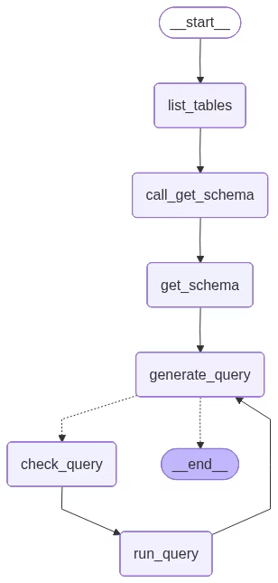

# 构建自定义SQL代理

在本教程中，我们将使用LangGraph构建一个可以回答关于SQL数据库问题的自定义代理。

LangChain提供了内置的[代理](../langchain/agents.html)实现，这些实现使用[LangGraph](overview.html)原语实现。如果需要更深入的自定义，代理可以直接在LangGraph中实现。本指南展示了SQL代理的示例实现。您可以在[这里](https://langchain-doc.cn/v1/python/langchain/sql-agent)找到使用更高级LangChain抽象构建SQL代理的教程。

**警告**
构建SQL数据库的问答系统需要执行模型生成的SQL查询。这样做存在固有的风险。确保您的数据库连接权限始终根据代理的需求尽可能严格地限制。这将减轻（但不能完全消除）构建模型驱动系统的风险。

[预构建的代理](https://langchain-doc.cn/v1/python/langchain/sql-agent)让我们能够快速开始，但我们依赖系统提示来约束其行为——例如，我们指示代理始终以"list tables"工具开始，并在执行查询前始终运行查询检查器工具。

我们可以通过在LangGraph中自定义代理来实施更高级别的控制。在这里，我们实现了一个简单的ReAct代理设置，具有专门用于特定工具调用的节点。我们将使用与预构建代理相同的状态。

## 概念

我们将涵盖以下概念：

- 用于从SQL数据库读取的[工具](../langchain/tools.html)
- LangGraph的[图API](https://langchain-doc.cn/v1/python/langgraph/graph-api)，包括状态、节点、边和条件边。
- [人机协作](interrupts.html)流程

## 设置

### 安装

```bash
pip install langchain  langgraph  langchain-community
```

### LangSmith

设置[LangSmith](https://smith.langchain.com)来检查链或代理内部发生的情况。然后设置以下环境变量：

```shell
export LANGSMITH_TRACING="true"
export LANGSMITH_API_KEY="..."
```

## 1. 选择LLM

选择支持[工具调用](../integrations/providers/overview.html)的模型：

以下示例中显示的输出使用了OpenAI。

## 2. 配置数据库

您将为本教程创建一个[SQLite数据库](https://www.sqlitetutorial.net/sqlite-sample-database/)。SQLite是一个轻量级数据库，易于设置和使用。我们将加载`chinook`数据库，这是一个代表数字媒体商店的示例数据库。

为了方便，我们已在公共GCS存储桶上托管了数据库(`Chinook.db`)。

```python
import requests, pathlib
url = "https://storage.googleapis.com/benchmarks-artifacts/chinook/Chinook.db"
local_path = pathlib.Path("Chinook.db")
if local_path.exists():
    print(f"{local_path} already exists, skipping download.")
else:
    response = requests.get(url)
    if response.status_code == 200:
        local_path.write_bytes(response.content)
        print(f"File downloaded and saved as {local_path}")
    else:
        print(f"Failed to download the file. Status code: {response.status_code}")
```

我们将使用`langchain_community`包中可用的方便SQL数据库包装器来与数据库交互。该包装器提供了一个简单的接口来执行SQL查询和获取结果：

```python
from langchain_community.utilities import SQLDatabase
db = SQLDatabase.from_uri("sqlite:///Chinook.db")
print(f"Dialect: {db.dialect}")
print(f"Available tables: {db.get_usable_table_names()}")
print(f'Sample output: {db.run("SELECT * FROM Artist LIMIT 5;")}')
```

输出：

```
Dialect: sqlite
Available tables: ['Album', 'Artist', 'Customer', 'Employee', 'Genre', 'Invoice', 'InvoiceLine', 'MediaType', 'Playlist', 'PlaylistTrack', 'Track']
Sample output: [(1, 'AC/DC'), (2, 'Accept'), (3, 'Aerosmith'), (4, 'Alanis Morissette'), (5, 'Alice In Chains')]
```

## 3. 添加数据库交互工具

使用`langchain_community`包中可用的`SQLDatabase`包装器来与数据库交互。该包装器提供了一个简单的接口来执行SQL查询和获取结果：

```python
from langchain_community.agent_toolkits import SQLDatabaseToolkit
toolkit = SQLDatabaseToolkit(db=db, llm=llm)
tools = toolkit.get_tools()
for tool in tools:
    print(f"{tool.name}: {tool.description}\n")
```

输出：

```
sql_db_query: Input to this tool is a detailed and correct SQL query, output is a result from the database. If the query is not correct, an error message will be returned. If an error is returned, rewrite the query, check the query, and try again. If you encounter an issue with Unknown column 'xxxx' in 'field list', use sql_db_schema to query the correct table fields.

sql_db_schema: Input to this tool is a comma-separated list of tables, output is the schema and sample rows for those tables. Be sure that the tables actually exist by calling sql_db_list_tables first! Example Input: table1, table2, table3

sql_db_list_tables: Input is an empty string, output is a comma-separated list of tables in the database.

sql_db_query_checker: Use this tool to double check if your query is correct before executing it. Always use this tool before executing a query with sql_db_query!
```

## 4. 定义应用步骤

我们为以下步骤构建专用节点：

- 列出数据库表
- 调用"获取模式"工具
- 生成查询
- 检查查询

将这些步骤放在专用节点中可以让我们（1）在需要时强制工具调用，（2）自定义与每个步骤相关的提示。

```python
from typing import Literal
from langchain.agents import ToolNode
from langchain.messages import AIMessage
from langchain_core.runnables import RunnableConfig
from langgraph.graph import END, START, MessagesState, StateGraph
get_schema_tool = next(tool for tool in tools if tool.name == "sql_db_schema")
get_schema_node = ToolNode([get_schema_tool], name="get_schema")
run_query_tool = next(tool for tool in tools if tool.name == "sql_db_query")
run_query_node = ToolNode([run_query_tool], name="run_query")
# 示例：创建预定的工具调用
def list_tables(state: MessagesState):
    tool_call = {
        "name": "sql_db_list_tables",
        "args": {},
        "id": "abc123",
        "type": "tool_call",
    }
    tool_call_message = AIMessage(content="", tool_calls=[tool_call])
    list_tables_tool = next(tool for tool in tools if tool.name == "sql_db_list_tables")
    tool_message = list_tables_tool.invoke(tool_call)
    response = AIMessage(f"Available tables: {tool_message.content}")
    return {"messages": [tool_call_message, tool_message, response]}
# 示例：强制模型创建工具调用
def call_get_schema(state: MessagesState):
    # 注意LangChain强制所有模型接受`tool_choice="any"`以及`tool_choice=<string name of tool>`
    llm_with_tools = llm.bind_tools([get_schema_tool], tool_choice="any")
    response = llm_with_tools.invoke(state["messages"])
    return {"messages": [response]}
generate_query_system_prompt = """
You are an agent designed to interact with a SQL database.
Given an input question, create a syntactically correct {dialect} query to run,
then look at the results of the query and return the answer. Unless the user
specifies a specific number of examples they wish to obtain, always limit your
query to at most {top_k} results.
You can order the results by a relevant column to return the most interesting
examples in the database. Never query for all the columns from a specific table,
only ask for the relevant columns given the question.
DO NOT make any DML statements (INSERT, UPDATE, DELETE, DROP etc.) to the database.
""".format(
    dialect=db.dialect,
    top_k=5,
)
def generate_query(state: MessagesState):
    system_message = {
        "role": "system",
        "content": generate_query_system_prompt,
    }
    # 我们在这里不强制工具调用，以允许模型在获得解决方案时自然响应
    llm_with_tools = llm.bind_tools([run_query_tool])
    response = llm_with_tools.invoke([system_message] + state["messages"])
    return {"messages": [response]}
check_query_system_prompt = """
You are a SQL expert with a strong attention to detail.
Double check the {dialect} query for common mistakes, including:
- Using NOT IN with NULL values
- Using UNION when UNION ALL should have been used
- Using BETWEEN for exclusive ranges
- Data type mismatch in predicates
- Properly quoting identifiers
- Using the correct number of arguments for functions
- Casting to the correct data type
- Using the proper columns for joins
If there are any of the above mistakes, rewrite the query. If there are no mistakes,
just reproduce the original query.
You will call the appropriate tool to execute the query after running this check.
""".format(dialect=db.dialect)
def check_query(state: MessagesState):
    system_message = {
        "role": "system",
        "content": check_query_system_prompt,
    }
    # 生成一个人工用户消息来检查
    tool_call = state["messages"][-1].tool_calls[0]
    user_message = {"role": "user", "content": tool_call["args"]["query"]}
    llm_with_tools = llm.bind_tools([run_query_tool], tool_choice="any")
    response = llm_with_tools.invoke([system_message, user_message])
    response.id = state["messages"][-1].id
    return {"messages": [response]}
```

## 5. 实现代理

我们现在可以使用[图API](https://langchain-doc.cn/v1/python/langgraph/graph-api)将这些步骤组装成一个工作流。我们在查询生成步骤定义一个[条件边](https://langchain-doc.cn/v1/python/langgraph/graph-api#conditional-edges)，如果生成了查询，它将路由到查询检查器，或者如果没有工具调用存在，则结束，这样LLM就已经提供了对查询的响应。

```python
def should_continue(state: MessagesState) -> Literal[END, "check_query"]:
    messages = state["messages"]
    last_message = messages[-1]
    if not last_message.tool_calls:
        return END
    else:
        return "check_query"
builder = StateGraph(MessagesState)
builder.add_node(list_tables)
builder.add_node(call_get_schema)
builder.add_node(get_schema_node, "get_schema")
builder.add_node(generate_query)
builder.add_node(check_query)
builder.add_node(run_query_node, "run_query")
builder.add_edge(START, "list_tables")
builder.add_edge("list_tables", "call_get_schema")
builder.add_edge("call_get_schema", "get_schema")
builder.add_edge("get_schema", "generate_query")
builder.add_conditional_edges(
    "generate_query",
    should_continue,
)
builder.add_edge("check_query", "run_query")
builder.add_edge("run_query", "generate_query")
agent = builder.compile()
```

我们在下面可视化应用程序：

```python
from IPython.display import Image, display
from langchain_core.runnables.graph import CurveStyle, MermaidDrawMethod, NodeStyles
display(Image(agent.get_graph().draw_mermaid_png()))
```



我们现在可以调用图：

```python
question = "Which genre on average has the longest tracks?"
for step in agent.stream(
    {"messages": [{"role": "user", "content": question}]},
    stream_mode="values",
):
    step["messages"][-1].pretty_print()
```

输出：

```
================================ Human Message =================================
Which genre on average has the longest tracks?
================================== Ai Message ==================================
Available tables: Album, Artist, Customer, Employee, Genre, Invoice, InvoiceLine, MediaType, Playlist, PlaylistTrack, Track
================================== Ai Message ==================================
Tool Calls:
  sql_db_schema (call_yzje0tj7JK3TEzDx4QnRR3lL)
 Call ID: call_yzje0tj7JK3TEzDx4QnRR3lL
  Args:
    table_names: Genre, Track
================================= Tool Message =================================
Name: sql_db_schema
CREATE TABLE "Genre" (
	"GenreId" INTEGER NOT NULL,
	"Name" NVARCHAR(120),
	PRIMARY KEY ("GenreId")
)
/*
3 rows from Genre table:
GenreId	Name
1	Rock
2	Jazz
3	Metal
*/
CREATE TABLE "Track" (
	"TrackId" INTEGER NOT NULL,
	"Name" NVARCHAR(200) NOT NULL,
	"AlbumId" INTEGER,
	"MediaTypeId" INTEGER NOT NULL,
	"GenreId" INTEGER,
	"Composer" NVARCHAR(220),
	"Milliseconds" INTEGER NOT NULL,
	"Bytes" INTEGER,
	"UnitPrice" NUMERIC(10, 2) NOT NULL,
	PRIMARY KEY ("TrackId"),
	FOREIGN KEY("MediaTypeId") REFERENCES "MediaType" ("MediaTypeId"),
	FOREIGN KEY("GenreId") REFERENCES "Genre" ("GenreId"),
	FOREIGN KEY("AlbumId") REFERENCES "Album" ("AlbumId")
)
/*
3 rows from Track table:
TrackId	Name	AlbumId	MediaTypeId	GenreId	Composer	Milliseconds	Bytes	UnitPrice
1	For Those About To Rock (We Salute You)	1	1	1	Angus Young, Malcolm Young, Brian Johnson	343719	11170334	0.99
2	Balls to the Wall	2	2	1	U. Dirkschneider, W. Hoffmann, H. Frank, P. Baltes, S. Kaufmann, G. Hoffmann	342562	5510424	0.99
3	Fast As a Shark	3	2	1	F. Baltes, S. Kaufman, U. Dirkscneider & W. Hoffman	230619	3990994	0.99
*/
================================== Ai Message ==================================
Tool Calls:
  sql_db_query (call_cb9ApLfZLSq7CWg6jd0im90b)
 Call ID: call_cb9ApLfZLSq7CWg6jd0im90b
  Args:
    query: SELECT Genre.Name, AVG(Track.Milliseconds) AS AvgMilliseconds FROM Track JOIN Genre ON Track.GenreId = Genre.GenreId GROUP BY Genre.GenreId ORDER BY AvgMilliseconds DESC LIMIT 5;
================================== Ai Message ==================================
Tool Calls:
  sql_db_query (call_DMVALfnQ4kJsuF3Yl6jxbeAU)
 Call ID: call_DMVALfnQ4kJsuF3Yl6jxbeAU
  Args:
    query: SELECT Genre.Name, AVG(Track.Milliseconds) AS AvgMilliseconds FROM Track JOIN Genre ON Track.GenreId = Genre.GenreId GROUP BY Genre.GenreId ORDER BY AvgMilliseconds DESC LIMIT 5;
================================= Tool Message =================================
Name: sql_db_query
[('Sci Fi & Fantasy', 2911783.0384615385), ('Science Fiction', 2625549.076923077), ('Drama', 2575283.78125), ('TV Shows', 2145041.0215053763), ('Comedy', 1585263.705882353)]
================================== Ai Message ==================================
The genre with the longest tracks on average is "Sci Fi & Fantasy," with an average track length of approximately 2,911,783 milliseconds. Other genres with relatively long tracks include "Science Fiction," "Drama," "TV Shows," and "Comedy."
```

**提示**
查看[LangSmith trace](https://smith.langchain.com/public/94b8c9ac-12f7-4692-8706-836a1f30f1ea/r)了解上述运行情况。

## 6. 实现人机协作审查

在执行之前检查代理的SQL查询是否有任何意外操作或效率低下是谨慎的做法。

在这里，我们利用LangGraph的[人机协作](interrupts.html)功能在执行SQL查询之前暂停运行并等待人工审查。使用LangGraph的[持久化层](persistence.html)，我们可以无限期暂停运行（或者至少只要持久化层存在）。

让我们将`sql_db_query`工具包装在一个接收人工输入的节点中。我们可以使用[interrupt](interrupts.html)函数实现这一点。下面，我们允许输入来批准工具调用，编辑其参数，或提供用户反馈。

```python
from langchain_core.runnables import RunnableConfig
from langchain.tools import tool
from langgraph.types import interrupt
@tool(
    run_query_tool.name,
    description=run_query_tool.description,
    args_schema=run_query_tool.args_schema
)
def run_query_tool_with_interrupt(config: RunnableConfig, **tool_input):
    request = {
        "action": run_query_tool.name,
        "args": tool_input,
        "description": "Please review the tool call"
    }
    response = interrupt([request])
    # 批准工具调用
    if response["type"] == "accept":
        tool_response = run_query_tool.invoke(tool_input, config)
    # 更新工具调用参数
    elif response["type"] == "edit":
        tool_input = response["args"]["args"]
        tool_response = run_query_tool.invoke(tool_input, config)
    # 用用户反馈响应LLM
    elif response["type"] == "response":
        user_feedback = response["args"]
        tool_response = user_feedback
    else:
        raise ValueError(f"Unsupported interrupt response type: {response['type']}")
    return tool_response
```

**注意**
上述实现遵循更广泛的[人机协作](interrupts.html)指南中的[工具中断示例](interrupts.html#configuring-interrupts)。有关详细信息和替代方案，请参阅该指南。

现在让我们重新组装我们的图。我们将用人工审查替换程序化检查。请注意，我们现在包括一个[检查点](persistence.html)；这是暂停和恢复运行所必需的。

```python
from langgraph.checkpoint.memory import InMemorySaver
def should_continue(state: MessagesState) -> Literal[END, "run_query"]:
    messages = state["messages"]
    last_message = messages[-1]
    if not last_message.tool_calls:
        return END
    else:
        return "run_query"
builder = StateGraph(MessagesState)
builder.add_node(list_tables)
builder.add_node(call_get_schema)
builder.add_node(get_schema_node, "get_schema")
builder.add_node(generate_query)
builder.add_node(run_query_node, "run_query")
builder.add_edge(START, "list_tables")
builder.add_edge("list_tables", "call_get_schema")
builder.add_edge("call_get_schema", "get_schema")
builder.add_edge("get_schema", "generate_query")
builder.add_conditional_edges(
    "generate_query",
    should_continue,
)
builder.add_edge("run_query", "generate_query")
checkpointer = InMemorySaver()
agent = builder.compile(checkpointer=checkpointer)
```

我们可以像以前一样调用图。这次，执行会被中断：

```python
import json
config = {"configurable": {"thread_id": "1"}}
question = "Which genre on average has the longest tracks?"
for step in agent.stream(
    {"messages": [{"role": "user", "content": question}]},
    config,
    stream_mode="values",
):
    if "messages" in step:
        step["messages"][-1].pretty_print()
    elif "__interrupt__" in step:
        action = step["__interrupt__"][0]
        print("INTERRUPTED:")
        for request in action.value:
            print(json.dumps(request, indent=2))
    else:
        pass
```

输出：

```
...
INTERRUPTED:
{
  "action": "sql_db_query",
  "args": {
    "query": "SELECT Genre.Name, AVG(Track.Milliseconds) AS AvgLength FROM Track JOIN Genre ON Track.GenreId = Genre.GenreId GROUP BY Genre.Name ORDER BY AvgLength DESC LIMIT 5;"
  },
  "description": "Please review the tool call"
}
```

我们可以使用[Command](https://langchain-doc.cn/v1/python/langgraph/use-graph-api#combine-control-flow-and-state-updates-with-command)接受或编辑工具调用：

```python
from langgraph.types import Command
for step in agent.stream(
    Command(resume={"type": "accept"}),
    # Command(resume={"type": "edit", "args": {"query": "..."}}),
    config,
    stream_mode="values",
):
    if "messages" in step:
        step["messages"][-1].pretty_print()
    elif "__interrupt__" in step:
        action = step["__interrupt__"][0]
        print("INTERRUPTED:")
        for request in action.value:
            print(json.dumps(request, indent=2))
    else:
        pass
```

输出：

```
================================== Ai Message ==================================
Tool Calls:
  sql_db_query (call_t4yXkD6shwdTPuelXEmY3sAY)
 Call ID: call_t4yXkD6shwdTPuelXEmY3sAY
  Args:
    query: SELECT Genre.Name, AVG(Track.Milliseconds) AS AvgLength FROM Track JOIN Genre ON Track.GenreId = Genre.GenreId GROUP BY Genre.Name ORDER BY AvgLength DESC LIMIT 5;
================================= Tool Message =================================
Name: sql_db_query
[('Sci Fi & Fantasy', 2911783.0384615385), ('Science Fiction', 2625549.076923077), ('Drama', 2575283.78125), ('TV Shows', 2145041.0215053763), ('Comedy', 1585263.705882353)]
================================== Ai Message ==================================
The genre with the longest average track length is "Sci Fi & Fantasy" with an average length of about 2,911,783 milliseconds. Other genres with long average track lengths include "Science Fiction," "Drama," "TV Shows," and "Comedy."
```

有关详细信息，请参阅[人机协作指南](interrupts.html)。

## 下一步

查看[评估图](https://langchain-doc.cn/langsmith/evaluate-graph)指南，了解如何使用LangSmith评估LangGraph应用程序，包括像这样的SQL代理。

## JavaScript实现

本教程尚未在TypeScript中实现。请参阅LangChain [SQL代理指南](https://langchain-doc.cn/v1/python/langchain/sql-agent)了解参考实现。