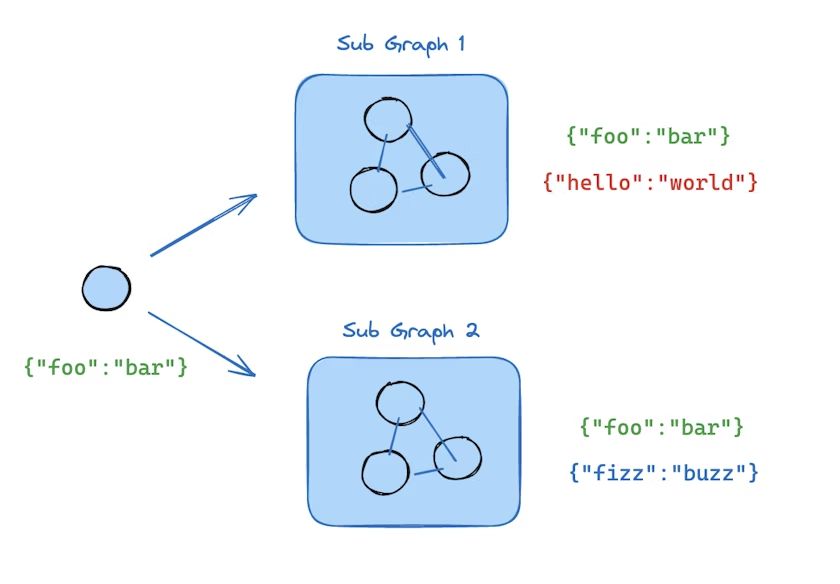

# 使用子图

子图是 LangGraph 中的一种强大抽象，允许您：

*   将复杂的工作流分解为更小、更易管理的组件
*   在多个图中重用图逻辑
*   创建分层图结构，实现嵌套的工作流

## 使用场景

子图在以下场景中特别有用：

*   **复杂工作流分解**：将大型工作流分解为更小的、专注于特定功能的组件
*   **组件重用**：在多个工作流中重用相同的图逻辑
*   **多代理系统**：构建由多个相互通信的代理组成的系统，每个代理可以是一个独立的图
*   **条件工作流**：根据某些条件执行不同的子工作流

## 设置

要使用子图，您需要安装 LangGraph：

```bash
pip install langgraph
```

```bash
npm install @langchain/langgraph
```

## 从节点调用子图

您可以从图中的节点调用子图。这是将子图集成到更复杂工作流中的常见方式。

### 不同状态模式

当子图和父图使用不同的状态模式时，您需要在它们之间转换状态。

<details>
<summary>完整示例：不同的状态模式</summary>

#### Python

```python
from typing_extensions import TypedDict
from langgraph.graph.state import StateGraph, START
# 定义子图
class SubgraphState(TypedDict):
    bar: str
def subgraph_node_1(state: SubgraphState):
    return {"bar": state["bar"] + "baz"}
def subgraph_node_2(state: SubgraphState):
    return {"bar": "hi! " + state["bar"]}
subgraph_builder = StateGraph(SubgraphState)
subgraph_builder.add_node("subgraphNode1", subgraph_node_1)
subgraph_builder.add_node("subgraphNode2", subgraph_node_2)
subgraph_builder.add_edge(START, "subgraphNode1")
subgraph_builder.add_edge("subgraphNode1", "subgraphNode2")
subgraph = subgraph_builder.compile()
# 定义父图
class ParentState(TypedDict):
    foo: str
def node_1(state: ParentState):
    return {"foo": "hi! " + state["foo"]}
def node_2(state: ParentState):
    # 1. 将状态转换为子图状态
    subgraph_input = {"bar": state["foo"]}
    # 2. 调用子图
    response = subgraph.invoke(subgraph_input)
    # 3. 将响应转换回父图状态
    return {"foo": response["bar"]}
builder = StateGraph(ParentState)
builder.add_node("node1", node_1)
builder.add_node("node2", node_2)
builder.add_edge(START, "node1")
builder.add_edge("node1", "node2")
graph = builder.compile()
for chunk in graph.stream({"foo": "foo"}, subgraphs=True):
    print(chunk)
```

输出：

```
((), {'node1': {'foo': 'hi! foo'}})
(('node2:9c36dd0f-151a-cb42-cbad-fa2f851f9ab7',), {'subgraphNode1': {'bar': 'foobaz'}})
(('node2:9c36dd0f-151a-cb42-cbad-fa2f851f9ab7',), {'subgraphNode2': {'bar': 'hi! foobaz'}})
((), {'node2': {'foo': 'hi! foobaz'}})
```

#### JavaScript

```typescript
import { StateGraph, START } from "@langchain/langgraph";
import * as z from "zod";
// 定义子图
const SubgraphState = z.object({
  bar: z.string(),
});
const subgraphBuilder = new StateGraph(SubgraphState)
  .addNode("subgraphNode1", (state) => {
    return { bar: state.bar + "baz" };
  })
  .addNode("subgraphNode2", (state) => {
    return { bar: "hi! " + state.bar };
  })
  .addEdge(START, "subgraphNode1")
  .addEdge("subgraphNode1", "subgraphNode2");
const subgraph = subgraphBuilder.compile();
// 定义父图
const ParentState = z.object({
  foo: z.string(),
});
const builder = new StateGraph(ParentState)
  .addNode("node1", (state) => {
    return { foo: "hi! " + state.foo };
  })
  .addNode("node2", async (state) => {
    const response = await subgraph.invoke({ bar: state.foo });
    return { foo: response.bar };
  })
  .addEdge(START, "node1")
  .addEdge("node1", "node2");
const graph = builder.compile();
for await (const chunk of await graph.stream(
  { foo: "foo" },
  { subgraphs: true }
)) {
  console.log(chunk);
}
```

1.  将状态转换为子图状态
2.  将响应转换回父图状态

输出：

```
[[], { node1: { foo: 'hi! foo' } }]
[['node2:9c36dd0f-151a-cb42-cbad-fa2f851f9ab7'], { subgraphNode1: { baz: 'baz' } }]
[['node2:9c36dd0f-151a-cb42-cbad-fa2f851f9ab7'], { subgraphNode2: { bar: 'hi! foobaz' } }]
[[], { node2: { foo: 'hi! foobaz' } }]
```

</details>

<details>
<summary>完整示例：不同状态模式（两级子图）</summary>

这是一个包含两级子图的示例：父图 -> 子图 -> 孙图。

#### Python

```python
# 孙图
from typing_extensions import TypedDict
from langgraph.graph.state import StateGraph, START, END
class GrandChildState(TypedDict):
    my_grandchild_key: str
def grandchild_1(state: GrandChildState) -> GrandChildState:
    # 注意：这里无法访问子图或父图的键
    return {"my_grandchild_key": state["my_grandchild_key"] + ", how are you"}
grandchild = StateGraph(GrandChildState)
grandchild.add_node("grandchild_1", grandchild_1)
grandchild.add_edge(START, "grandchild_1")
grandchild.add_edge("grandchild_1", END)
grandchild_graph = grandchild.compile()
# 子图
class ChildState(TypedDict):
    my_child_key: str
def call_grandchild_graph(state: ChildState) -> ChildState:
    # 注意：这里无法访问父图或孙图的键
    grandchild_graph_input = {"my_grandchild_key": state["my_child_key"]}
    grandchild_graph_output = grandchild_graph.invoke(grandchild_graph_input)
    return {"my_child_key": grandchild_graph_output["my_grandchild_key"] + " today?"}
child = StateGraph(ChildState)
# 我们在这里传递一个函数而不仅仅是编译好的图（`grandchild_graph`）
child.add_node("child_1", call_grandchild_graph)
child.add_edge(START, "child_1")
child.add_edge("child_1", END)
child_graph = child.compile()
# 父图
class ParentState(TypedDict):
    my_key: str
def parent_1(state: ParentState) -> ParentState:
    # 注意：这里无法访问子图或孙图的键
    return {"my_key": "hi " + state["my_key"]}
def parent_2(state: ParentState) -> ParentState:
    return {"my_key": state["my_key"] + " bye!"}
def call_child_graph(state: ParentState) -> ParentState:
    child_graph_input = {"my_child_key": state["my_key"]}
    child_graph_output = child_graph.invoke(child_graph_input)
    return {"my_key": child_graph_output["my_child_key"]}
parent = StateGraph(ParentState)
parent.add_node("parent_1", parent_1)
# 我们在这里传递一个函数而不仅仅是编译好的图（`child_graph`）
parent.add_node("child", call_child_graph)
parent.add_node("parent_2", parent_2)
parent.add_edge(START, "parent_1")
parent.add_edge("parent_1", "child")
parent.add_edge("child", "parent_2")
parent.add_edge("parent_2", END)
parent_graph = parent.compile()
for chunk in parent_graph.stream({"my_key": "Bob"}, subgraphs=True):
    print(chunk)
```

输出：

```
((), {'parent_1': {'my_key': 'hi Bob'}})
(('child:2e26e9ce-602f-862c-aa66-1ea5a4655e3b', 'child_1:781bb3b1-3971-84ce-810b-acf819a03f9c'), {'grandchild_1': {'my_grandchild_key': 'hi Bob, how are you'}})
(('child:2e26e9ce-602f-862c-aa66-1ea5a4655e3b',), {'child_1': {'my_child_key': 'hi Bob, how are you today?'}})
((), {'child': {'my_key': 'hi Bob, how are you today?'}})
((), {'parent_2': {'my_key': 'hi Bob, how are you today? bye!'}})
```

#### JavaScript

```typescript
import { StateGraph, START, END } from "@langchain/langgraph";
import * as z from "zod";
// 孙图
const GrandChildState = z.object({
  myGrandchildKey: z.string(),
});
const grandchild = new StateGraph(GrandChildState)
  .addNode("grandchild1", (state) => {
    // 注意：这里无法访问子图或父图的键
    return { myGrandchildKey: state.myGrandchildKey + ", how are you" };
  })
  .addEdge(START, "grandchild1")
  .addEdge("grandchild1", END);
const grandchildGraph = grandchild.compile();
// 子图
const ChildState = z.object({
  myChildKey: z.string(),
});
const child = new StateGraph(ChildState)
  .addNode("child1", async (state) => {
    // 注意：这里无法访问父图或孙图的键
    const grandchildGraphInput = { myGrandchildKey: state.myChildKey };
    const grandchildGraphOutput = await grandchildGraph.invoke(grandchildGraphInput);
    return { myChildKey: grandchildGraphOutput.myGrandchildKey + " today?" };
  })
  .addEdge(START, "child1")
  .addEdge("child1", END);
const childGraph = child.compile();
// 父图
const ParentState = z.object({
  myKey: z.string(),
});
const parent = new StateGraph(ParentState)
  .addNode("parent1", (state) => {
    // 注意：这里无法访问子图或孙图的键
    return { myKey: "hi " + state.myKey };
  })
  .addNode("child", async (state) => {
    const childGraphInput = { myChildKey: state.myKey };
    const childGraphOutput = await childGraph.invoke(childGraphInput);
    return { myKey: childGraphOutput.myChildKey };
  })
  .addNode("parent2", (state) => {
    return { myKey: state.myKey + " bye!" };
  })
  .addEdge(START, "parent1")
  .addEdge("parent1", "child")
  .addEdge("child", "parent2")
  .addEdge("parent2", END);
const parentGraph = parent.compile();
for await (const chunk of await parentGraph.stream(
  { myKey: "Bob" },
  { subgraphs: true }
)) {
  console.log(chunk);
}
```

1.  我们正在将状态从子图状态通道（`myChildKey`）转换到孙图状态通道（`myGrandchildKey`）
2.  我们正在将状态从孙图状态通道（`myGrandchildKey`）转换回子图状态通道（`myChildKey`）
3.  我们在这里传递一个函数而不仅仅是编译好的图（`grandchildGraph`）
4.  我们正在将状态从父图状态通道（`myKey`）转换到子图状态通道（`myChildKey`）
5.  我们正在将状态从子图状态通道（`myChildKey`）转换回父图状态通道（`myKey`）
6.  我们在这里传递一个函数而不仅仅是编译好的图（`childGraph`）

输出：

```
[[], { parent1: { myKey: 'hi Bob' } }]
[['child:2e26e9ce-602f-862c-aa66-1ea5a4655e3b', 'child1:781bb3b1-3971-84ce-810b-acf819a03f9c'], { grandchild1: { myGrandchildKey: 'hi Bob, how are you' } }]
[['child:2e26e9ce-602f-862c-aa66-1ea5a4655e3b'], { child1: { myChildKey: 'hi Bob, how are you today?' } }]
[[], { child: { myKey: 'hi Bob, how are you today?' } }]
[[], { parent2: { myKey: 'hi Bob, how are you today? bye!' } }]
```

</details>

## 将图作为节点添加

当父图和子图可以通过[模式](https://langchain-doc.cn/v1/python/langgraph/graph-api#state)中的共享状态键（通道）进行通信时，您可以将一个图作为另一个图中的[节点](https://langchain-doc.cn/v1/python/langgraph/graph-api#nodes)添加。例如，在[多代理](../langchain/multi-agent.html)系统中，代理通常通过共享的[消息](https://langchain-doc.cn/v1/python/langgraph/graph-api#why-use-messages)键进行通信。



如果您的子图与父图共享状态键，您可以按照以下步骤将其添加到您的图中：

#### Python

1.  定义子图工作流（在下面的示例中为`subgraph_builder`）并编译它
2.  在定义父图工作流时，将编译好的子图传递给`add_node`方法

```python
from typing_extensions import TypedDict
from langgraph.graph.state import StateGraph, START
class State(TypedDict):
    foo: str
# 子图
def subgraph_node_1(state: State):
    return {"foo": "hi! " + state["foo"]}
subgraph_builder = StateGraph(State)
subgraph_builder.add_node(subgraph_node_1)
subgraph_builder.add_edge(START, "subgraph_node_1")
subgraph = subgraph_builder.compile()
# 父图
builder = StateGraph(State)
builder.add_node("node_1", subgraph)
builder.add_edge(START, "node_1")
graph = builder.compile()
```

#### JavaScript

1.  定义子图工作流（在下面的示例中为`subgraphBuilder`）并编译它
2.  在定义父图工作流时，将编译好的子图传递给`.addNode`方法

```typescript
import { StateGraph, START } from "@langchain/langgraph";
import * as z from "zod";
const State = z.object({
  foo: z.string(),
});
// 子图
const subgraphBuilder = new StateGraph(State)
  .addNode("subgraphNode1", (state) => {
    return { foo: "hi! " + state.foo };
  })
  .addEdge(START, "subgraphNode1");
const subgraph = subgraphBuilder.compile();
// 父图
const builder = new StateGraph(State)
  .addNode("node1", subgraph)
  .addEdge(START, "node1");
const graph = builder.compile();
```

<details>
<summary>完整示例：共享状态模式</summary>

#### Python

```python
from typing_extensions import TypedDict
from langgraph.graph.state import StateGraph, START
# 定义子图
class SubgraphState(TypedDict):
    foo: str  # 与父图状态共享
    bar: str  # 仅对子图状态可见
def subgraph_node_1(state: SubgraphState):
    return {"bar": "bar"}
def subgraph_node_2(state: SubgraphState):
    # 注意：这个节点正在使用仅在子图中可用的状态键（'bar'）
    # 并在共享状态键（'foo'）上发送更新
    return {"foo": state["foo"] + state["bar"]}
subgraph_builder = StateGraph(SubgraphState)
subgraph_builder.add_node(subgraph_node_1)
subgraph_builder.add_node(subgraph_node_2)
subgraph_builder.add_edge(START, "subgraph_node_1")
subgraph_builder.add_edge("subgraph_node_1", "subgraph_node_2")
subgraph = subgraph_builder.compile()
# 定义父图
class ParentState(TypedDict):
    foo: str
def node_1(state: ParentState):
    return {"foo": "hi! " + state["foo"]}
builder = StateGraph(ParentState)
builder.add_node("node_1", node_1)
builder.add_node("node_2", subgraph)
builder.add_edge(START, "node_1")
builder.add_edge("node_1", "node_2")
graph = builder.compile()
for chunk in graph.stream({"foo": "foo"}):
    print(chunk)
```

输出：

```
{'node_1': {'foo': 'hi! foo'}}
{'node_2': {'foo': 'hi! foobar'}}
```

#### JavaScript

```typescript
import { StateGraph, START } from "@langchain/langgraph";
import * as z from "zod";
// 定义子图
const SubgraphState = z.object({
  foo: z.string(),    // 与父图状态共享
  bar: z.string(),    // 仅对子图状态可见
});
const subgraphBuilder = new StateGraph(SubgraphState)
  .addNode("subgraphNode1", (state) => {
    return { bar: "bar" };
  })
  .addNode("subgraphNode2", (state) => {
    // 注意：这个节点正在使用仅在子图中可用的状态键（'bar'）
    // 并在共享状态键（'foo'）上发送更新
    return { foo: state.foo + state.bar };
  })
  .addEdge(START, "subgraphNode1")
  .addEdge("subgraphNode1", "subgraphNode2");
const subgraph = subgraphBuilder.compile();
// 定义父图
const ParentState = z.object({
  foo: z.string(),
});
const builder = new StateGraph(ParentState)
  .addNode("node1", (state) => {
    return { foo: "hi! " + state.foo };
  })
  .addNode("node2", subgraph)
  .addEdge(START, "node1")
  .addEdge("node1", "node2");
const graph = builder.compile();
for await (const chunk of await graph.stream({ foo: "foo" })) {
  console.log(chunk);
}
```

1.  这个键与父图状态共享
2.  这个键仅对子图状态可见，对父图不可见

输出：

```
{ node1: { foo: 'hi! foo' } }
{ node2: { foo: 'hi! foobar' } }
```

</details>

## 添加持久性

您只需要**在编译父图时提供检查点**。LangGraph 会自动将检查点传播到子子图。

#### Python

```python
from langgraph.graph import START, StateGraph
from langgraph.checkpoint.memory import MemorySaver
from typing_extensions import TypedDict
class State(TypedDict):
    foo: str
# 子图
def subgraph_node_1(state: State):
    return {"foo": state["foo"] + "bar"}
subgraph_builder = StateGraph(State)
subgraph_builder.add_node(subgraph_node_1)
subgraph_builder.add_edge(START, "subgraph_node_1")
subgraph = subgraph_builder.compile()
# 父图
builder = StateGraph(State)
builder.add_node("node_1", subgraph)
builder.add_edge(START, "node_1")
checkpointer = MemorySaver()
graph = builder.compile(checkpointer=checkpointer)
```

#### JavaScript

```typescript
import { StateGraph, START, MemorySaver } from "@langchain/langgraph";
import * as z from "zod";
const State = z.object({
  foo: z.string(),
});
// 子图
const subgraphBuilder = new StateGraph(State)
  .addNode("subgraphNode1", (state) => {
    return { foo: state.foo + "bar" };
  })
  .addEdge(START, "subgraphNode1");
const subgraph = subgraphBuilder.compile();
// 父图
const builder = new StateGraph(State)
  .addNode("node1", subgraph)
  .addEdge(START, "node1");
const checkpointer = new MemorySaver();
const graph = builder.compile({ checkpointer });
```

如果您希望子图**拥有自己的内存**，您可以使用适当的检查点选项编译它。这在[多代理](../langchain/multi-agent.html)系统中很有用，如果您希望代理跟踪其内部消息历史：

#### Python

```python
subgraph_builder = StateGraph(...)
subgraph = subgraph_builder.compile(checkpointer=True)
```

#### JavaScript

```typescript
const subgraphBuilder = new StateGraph(...)
const subgraph = subgraphBuilder.compile({ checkpointer: true });
```

## 查看子图状态

当您启用[持久性](persistence.html)时，您可以通过适当的方法[检查图状态](persistence.html#checkpoints)（检查点）。要查看子图状态，您可以使用subgraphs选项。

#### Python

您可以通过`graph.get_state(config)`检查图状态。要查看子图状态，您可以使用`graph.get_state(config, subgraphs=True)`。

#### JavaScript

您可以通过`graph.getState(config)`检查图状态。要查看子图状态，您可以使用`graph.getState(config, { subgraphs: true })`。

**警告**
**仅在中断时可用**
子图状态只能在**子图被中断时**查看。一旦您恢复图，您将无法访问子图状态。

<details>
<summary>查看中断的子图状态</summary>

#### Python

```python
from langgraph.graph import START, StateGraph
from langgraph.checkpoint.memory import MemorySaver
from langgraph.types import interrupt, Command
from typing_extensions import TypedDict
class State(TypedDict):
    foo: str
# 子图
def subgraph_node_1(state: State):
    value = interrupt("Provide value:")
    return {"foo": state["foo"] + value}
subgraph_builder = StateGraph(State)
subgraph_builder.add_node(subgraph_node_1)
subgraph_builder.add_edge(START, "subgraph_node_1")
subgraph = subgraph_builder.compile()
# 父图
builder = StateGraph(State)
builder.add_node("node_1", subgraph)
builder.add_edge(START, "node_1")
checkpointer = MemorySaver()
graph = builder.compile(checkpointer=checkpointer)
config = {"configurable": {"thread_id": "1"}}
graph.invoke({"foo": ""}, config)
parent_state = graph.get_state(config)
# 这仅在子图被中断时可用。
# 一旦您恢复图，您将无法访问子图状态。
subgraph_state = graph.get_state(config, subgraphs=True).tasks[0].state
# 恢复子图
graph.invoke(Command(resume="bar"), config)
```

1.  这仅在子图被中断时可用。一旦您恢复图，您将无法访问子图状态。

#### JavaScript

```typescript
import { StateGraph, START, MemorySaver, interrupt, Command } from "@langchain/langgraph";
import * as z from "zod";
const State = z.object({
  foo: z.string(),
});
// 子图
const subgraphBuilder = new StateGraph(State)
  .addNode("subgraphNode1", (state) => {
    const value = interrupt("Provide value:");
    return { foo: state.foo + value };
  })
  .addEdge(START, "subgraphNode1");
const subgraph = subgraphBuilder.compile();
// 父图
const builder = new StateGraph(State)
  .addNode("node1", subgraph)
  .addEdge(START, "node1");
const checkpointer = new MemorySaver();
const graph = builder.compile({ checkpointer });
const config = { configurable: { thread_id: "1" } };
await graph.invoke({ foo: "" }, config);
const parentState = await graph.getState(config);
const subgraphState = (await graph.getState(config, { subgraphs: true })).tasks[0].state;
// 恢复子图
await graph.invoke(new Command({ resume: "bar" }), config);
```

</details>

## 流式传输子图输出

要在流式输出中包含来自子图的输出，您可以在父图的stream方法中设置subgraphs选项。这将流式传输来自父图和任何子图的输出。

#### Python

```python
for chunk in graph.stream(
    {"foo": "foo"},
    subgraphs=True, # 设置为true以流式传输子图输出
    stream_mode="updates",
):
    print(chunk)
```

#### JavaScript

```typescript
for await (const chunk of await graph.stream(
  { foo: "foo" },
  {
    subgraphs: true,   // 设置为true以流式传输子图输出
    streamMode: "updates",
  }
)) {
  console.log(chunk);
}
```

1.  设置`subgraphs: true`以流式传输子图输出。

<details>
<summary>从子图流式传输</summary>

#### Python

```python
from typing_extensions import TypedDict
from langgraph.graph.state import StateGraph, START
# 定义子图
class SubgraphState(TypedDict):
    foo: str
    bar: str
def subgraph_node_1(state: SubgraphState):
    return {"bar": "bar"}
def subgraph_node_2(state: SubgraphState):
    # 注意：这个节点正在使用仅在子图中可用的状态键（'bar'）
    # 并在共享状态键（'foo'）上发送更新
    return {"foo": state["foo"] + state["bar"]}
subgraph_builder = StateGraph(SubgraphState)
subgraph_builder.add_node(subgraph_node_1)
subgraph_builder.add_node(subgraph_node_2)
subgraph_builder.add_edge(START, "subgraph_node_1")
subgraph_builder.add_edge("subgraph_node_1", "subgraph_node_2")
subgraph = subgraph_builder.compile()
# 定义父图
class ParentState(TypedDict):
    foo: str
def node_1(state: ParentState):
    return {"foo": "hi! " + state["foo"]}
builder = StateGraph(ParentState)
builder.add_node("node_1", node_1)
builder.add_node("node_2", subgraph)
builder.add_edge(START, "node_1")
builder.add_edge("node_1", "node_2")
graph = builder.compile()
for chunk in graph.stream(
    {"foo": "foo"},
    stream_mode="updates",
    subgraphs=True, # 设置为true以流式传输子图输出
):
    print(chunk)
```

输出：

```
((), {'node_1': {'foo': 'hi! foo'}})
(('node_2:e58e5673-a661-ebb0-70d4-e298a7fc28b7',), {'subgraph_node_1': {'bar': 'bar'}})
(('node_2:e58e5673-a661-ebb0-70d4-e298a7fc28b7',), {'subgraph_node_2': {'foo': 'hi! foobar'}})
((), {'node_2': {'foo': 'hi! foobar'}})
```

#### JavaScript

```typescript
import { StateGraph, START } from "@langchain/langgraph";
import * as z from "zod";
// 定义子图
const SubgraphState = z.object({
  foo: z.string(),
  bar: z.string(),
});
const subgraphBuilder = new StateGraph(SubgraphState)
  .addNode("subgraphNode1", (state) => {
    return { bar: "bar" };
  })
  .addNode("subgraphNode2", (state) => {
    // 注意：这个节点正在使用仅在子图中可用的状态键（'bar'）
    // 并在共享状态键（'foo'）上发送更新
    return { foo: state.foo + state.bar };
  })
  .addEdge(START, "subgraphNode1")
  .addEdge("subgraphNode1", "subgraphNode2");
const subgraph = subgraphBuilder.compile();
// 定义父图
const ParentState = z.object({
  foo: z.string(),
});
const builder = new StateGraph(ParentState)
  .addNode("node1", (state) => {
    return { foo: "hi! " + state.foo };
  })
  .addNode("node2", subgraph)
  .addEdge(START, "node1")
  .addEdge("node1", "node2");
const graph = builder.compile();
for await (const chunk of await graph.stream(
  { foo: "foo" },
  {
    streamMode: "updates",
    subgraphs: true,   // 设置为true以流式传输子图输出
  }
)) {
  console.log(chunk);
}
```

1.  设置`subgraphs: true`以流式传输子图输出。

输出：

```
[[], { node1: { foo: 'hi! foo' } }]
[['node2:e58e5673-a661-ebb0-70d4-e298a7fc28b7'], { subgraphNode1: { bar: 'bar' } }]
[['node2:e58e5673-a661-ebb0-70d4-e298a7fc28b7'], { subgraphNode2: { foo: 'hi! foobar' } }]
[[], { node2: { foo: 'hi! foobar' } }]
```

</details>