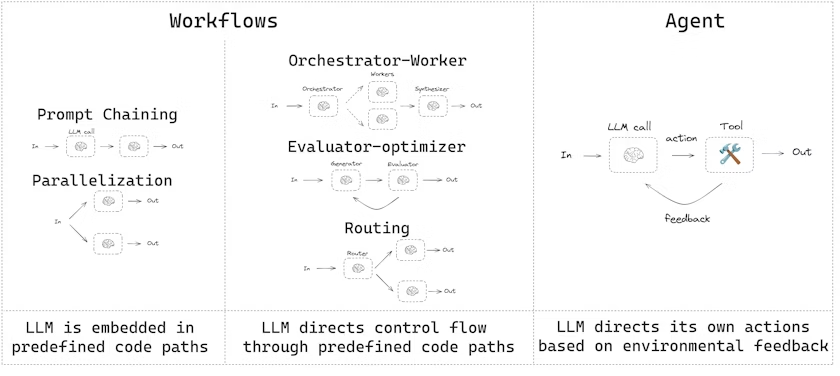
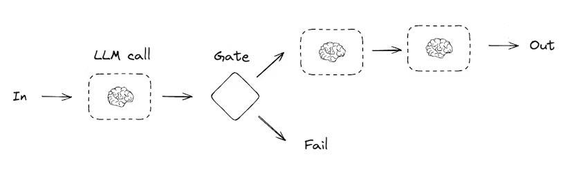
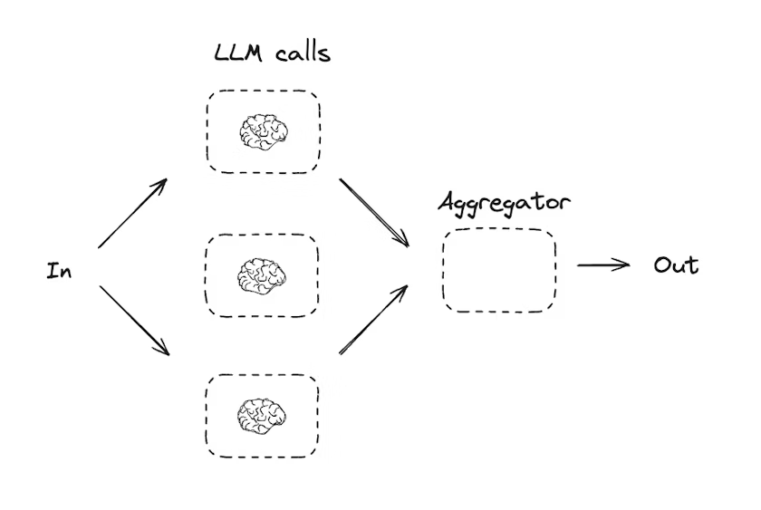
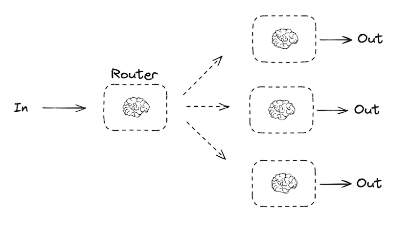
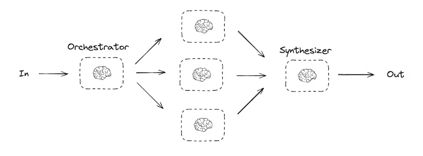

# 工作流与智能体

在 LangChain 中，您可以构建工作流和智能体，它们分别适用于不同类型的应用场景。本指南将介绍这两种模式以及何时使用它们。

## 工作流

工作流是预定义的执行路径，其中每个步骤都按照特定顺序执行。它们适用于问题和解决方案可预测的情况。工作流可以包含条件分支、循环和并行执行。



### 为什么使用 LangGraph 构建工作流？

LangGraph 为构建 LLM 应用工作流提供了几个关键优势：

*   **持久性**：工作流状态会自动保存，支持中断和恢复执行
*   **流式处理**：实时查看工作流的执行过程和中间结果
*   **调试**：跟踪每个步骤的状态变化和执行路径
*   **部署**：轻松部署为服务或嵌入到现有应用程序中

### 安装

在开始之前，确保安装了 LangGraph：

```bash
pip install langgraph
```

对于 TypeScript：

```bash
npm install @langchain/langgraph
```

### 初始化 LLM

让我们首先设置我们的 LLM。我们将使用 Anthropic 的模型，因为它们在结构化输出和工具使用方面表现出色。

```python
from langchain_anthropic import ChatAnthropic
# 初始化 LLM
llm = ChatAnthropic(model="claude-3-opus-20240229")
```

对于 JavaScript：

```typescript
import { ChatAnthropic } from "@langchain/anthropic";
// 初始化 LLM
const llm = new ChatAnthropic({
  model: "claude-3-opus-20240229",
});
```

### 结构化输出

在构建工作流时，我们经常需要从 LLM 获取结构化输出。我们可以使用 Pydantic 来定义输出模式。

```python
from pydantic import BaseModel, Field
# 定义结构化输出的模型
class MultiplierResponse(BaseModel):
    result: int = Field(description="乘法运算的结果")
# 使用结构化输出增强 LLM
llm_with_structured_output = llm.with_structured_output(MultiplierResponse)
# 调用 LLM 并获取结构化输出
response = llm_with_structured_output.invoke("计算 5 乘以 3 的结果")
print(response.result)  # 输出: 15
```

对于 TypeScript，我们使用 Zod 来定义模式：

```typescript
import * as z from "zod";
// 定义结构化输出的模型
const multiplierResponseSchema = z.object({
  result: z.number().describe("乘法运算的结果"),
});
// 使用结构化输出增强 LLM
const llmWithStructuredOutput = llm.withStructuredOutput(multiplierResponseSchema);
// 调用 LLM 并获取结构化输出
const response = await llmWithStructuredOutput.invoke("计算 5 乘以 3 的结果");
console.log(response.result);  // 输出: 15
```

### 工具

工具是可以由 LLM 或工作流调用的函数。它们允许我们扩展 LLM 的能力，使其能够执行计算、访问外部系统等。

```python
from langchain.tools import tool
# 定义一个工具
@tool
def multiply(a: int, b: int) -> int:
    """计算 `a` 和 `b` 的乘积。
    Args:
        a: 第一个整数
        b: 第二个整数
    """
    return a * b
# 使用工具
tool_result = multiply.invoke({"a": 5, "b": 3})
print(tool_result)  # 输出: 15
```

对于 TypeScript：

```typescript
import { tool } from "@langchain/core/tools";
import * as z from "zod";
// 定义一个工具
const multiply = tool(
  ({ a, b }) => {
    return a * b;
  },
  {
    name: "multiply",
    description: "计算两个数字的乘积",
    schema: z.object({
      a: z.number().describe("第一个数字"),
      b: z.number().describe("第二个数字"),
    }),
  }
);
// 使用工具
const toolResult = await multiply.invoke({ a: 5, b: 3 });
console.log(toolResult);  // 输出: 15
```

## 常见工作流模式

以下是一些常见的工作流模式及其使用场景：

### 提示链

提示链是按顺序执行的一系列提示。它们适用于需要将一个步骤的输出作为下一个步骤的输入的情况。



让我们构建一个简单的提示链，用于生成一个笑话，然后检查笑点是否合适，如果不合适则改进它：

```python
from typing import Annotated
from langgraph.graph import StateGraph, START, END
from langgraph.types import StateGraph
from pydantic import BaseModel, Field
from typing_extensions import TypedDict, Literal
from operator import add
# 定义图状态
class State(TypedDict):
    joke: str
    topic: str
    punchline: str
    needs_improvement: bool
# 定义用于评估笑话的结构化输出模型
class PunchlineEvaluation(BaseModel):
    needs_improvement: bool = Field(
        description="判断笑话是否需要改进。如果笑点明显或平庸，返回 true。"
    )
# 使用结构化输出增强 LLM
evaluator = llm.with_structured_output(PunchlineEvaluation)
# 节点
def generate_joke(state: State):
    """生成一个关于给定主题的笑话"""
    joke = llm.invoke(f"写一个关于 {state['topic']} 的笑话")
    return {"joke": joke.content}
def check_punchline(state: State):
    """检查笑话是否需要改进"""
    evaluation = evaluator.invoke(f"评估这个笑话的笑点: {state['joke']}")
    return {"needs_improvement": evaluation.needs_improvement}
def improve_joke(state: State):
    """改进笑话"""
    improved_joke = llm.invoke(f"改进这个笑话，使其更有趣: {state['joke']}")
    return {"joke": improved_joke.content}
def polish_joke(state: State):
    """润色笑话，确保质量"""
    polished_joke = llm.invoke(f"润色这个笑话，使其更加完美: {state['joke']}")
    return {"joke": polished_joke.content}
# 条件边函数，根据笑话是否需要改进来决定路由
def should_improve_joke(state: State):
    """根据笑话是否需要改进来决定路由"""
    if state["needs_improvement"]:
        return "improve_joke"
    else:
        return "polish_joke"
# 构建工作流
workflow_builder = StateGraph(State)
# 添加节点
workflow_builder.add_node("generate_joke", generate_joke)
workflow_builder.add_node("check_punchline", check_punchline)
workflow_builder.add_node("improve_joke", improve_joke)
workflow_builder.add_node("polish_joke", polish_joke)
# 添加边来连接节点
workflow_builder.add_edge(START, "generate_joke")
workflow_builder.add_edge("generate_joke", "check_punchline")
workflow_builder.add_conditional_edges(
    "check_punchline",
    should_improve_joke,
    {  # 由 should_improve_joke 返回的值 : 要访问的下一个节点的名称
        "improve_joke": "improve_joke",
        "polish_joke": "polish_joke"
    }
)
workflow_builder.add_edge("improve_joke", "polish_joke")
workflow_builder.add_edge("polish_joke", END)
# 编译工作流
workflow = workflow_builder.compile()
# 显示工作流
from IPython.display import display, Image
display(Image(workflow.get_graph().draw_mermaid_png()))
# 调用
state = workflow.invoke({"topic": "编程"})
print(state["joke"])
```

对于 Functional API：

```python
from langgraph.graph import task, entrypoint
from pydantic import BaseModel, Field
from typing import Optional
# 定义用于评估笑话的结构化输出模型
class PunchlineEvaluation(BaseModel):
    needs_improvement: bool = Field(
        description="判断笑话是否需要改进。如果笑点明显或平庸，返回 true。"
    )
# 使用结构化输出增强 LLM
evaluator = llm.with_structured_output(PunchlineEvaluation)
# 节点
@task
def generate_joke(topic: str):
    """生成一个关于给定主题的笑话"""
    joke = llm.invoke(f"写一个关于 {topic} 的笑话")
    return joke.content
@task
def check_punchline(joke: str):
    """检查笑话是否需要改进"""
    evaluation = evaluator.invoke(f"评估这个笑话的笑点: {joke}")
    return evaluation.needs_improvement
@task
def improve_joke(joke: str):
    """改进笑话"""
    improved_joke = llm.invoke(f"改进这个笑话，使其更有趣: {joke}")
    return improved_joke.content
@task
def polish_joke(joke: str):
    """润色笑话，确保质量"""
    polished_joke = llm.invoke(f"润色这个笑话，使其更加完美: {joke}")
    return polished_joke.content
@entrypoint()
def workflow(topic: str):
    joke = generate_joke(topic).result()
    needs_improvement = check_punchline(joke).result()
    if needs_improvement:
        joke = improve_joke(joke).result()
    joke = polish_joke(joke).result()
    return joke
# 调用
joke = workflow.invoke("编程")
print(joke)
# 流式处理
for step in workflow.stream("编程", stream_mode="updates"):
    print(step)
    print("\n")
```

对于 TypeScript：

```typescript
import { Annotation, StateGraph } from "@langchain/langgraph";
import * as z from "zod";
// 定义图状态
const StateAnnotation = Annotation.Root({
  joke: Annotation<string>,
  topic: Annotation<string>,
  punchline: Annotation<string>,
  needsImprovement: Annotation<boolean>,
});
// 定义用于评估笑话的结构化输出模型
const punchlineEvaluationSchema = z.object({
  needsImprovement: z.boolean().describe(
    "判断笑话是否需要改进。如果笑点明显或平庸，返回 true。"
  ),
});
// 使用结构化输出增强 LLM
const evaluator = llm.withStructuredOutput(punchlineEvaluationSchema);
// 节点
async function generateJoke(state: typeof StateAnnotation.State) {
  // 生成一个关于给定主题的笑话
  const joke = await llm.invoke(`写一个关于 ${state.topic} 的笑话`);
  return { joke: joke.content };
}
async function checkPunchline(state: typeof StateAnnotation.State) {
  // 检查笑话是否需要改进
  const evaluation = await evaluator.invoke(`评估这个笑话的笑点: ${state.joke}`);
  return { needsImprovement: evaluation.needsImprovement };
}
async function improveJoke(state: typeof StateAnnotation.State) {
  // 改进笑话
  const improvedJoke = await llm.invoke(`改进这个笑话，使其更有趣: ${state.joke}`);
  return { joke: improvedJoke.content };
}
async function polishJoke(state: typeof StateAnnotation.State) {
  // 润色笑话，确保质量
  const polishedJoke = await llm.invoke(`润色这个笑话，使其更加完美: ${state.joke}`);
  return { joke: polishedJoke.content };
}
// 条件边函数，根据笑话是否需要改进来决定路由
function shouldImproveJoke(state: typeof StateAnnotation.State) {
  // 根据笑话是否需要改进来决定路由
  if (state.needsImprovement) {
    return "improveJoke";
  } else {
    return "polishJoke";
  }
}
// 构建工作流
const workflow = new StateGraph(StateAnnotation)
  .addNode("generateJoke", generateJoke)
  .addNode("checkPunchline", checkPunchline)
  .addNode("improveJoke", improveJoke)
  .addNode("polishJoke", polishJoke)
  .addEdge("__start__", "generateJoke")
  .addEdge("generateJoke", "checkPunchline")
  .addConditionalEdges(
    "checkPunchline",
    shouldImproveJoke,
    {
      "improveJoke": "improveJoke",
      "polishJoke": "polishJoke"
    }
  )
  .addEdge("improveJoke", "polishJoke")
  .addEdge("polishJoke", "__end__")
  .compile();
// 调用
const state = await workflow.invoke({ topic: "编程" });
console.log(state.joke);
// 流式处理
const stream = await workflow.stream({ topic: "编程" }, {
  streamMode: "updates",
});
for await (const step of stream) {
  console.log(step);
  console.log("\n");
}
```

对于 TypeScript Functional API：

```typescript
import { task, entrypoint } from "@langchain/langgraph";
import * as z from "zod";
// 定义用于评估笑话的结构化输出模型
const punchlineEvaluationSchema = z.object({
  needsImprovement: z.boolean().describe(
    "判断笑话是否需要改进。如果笑点明显或平庸，返回 true。"
  ),
});
// 使用结构化输出增强 LLM
const evaluator = llm.withStructuredOutput(punchlineEvaluationSchema);
// 节点
const generateJoke = task("generateJoke", async (topic: string) => {
  // 生成一个关于给定主题的笑话
  const joke = await llm.invoke(`写一个关于 ${topic} 的笑话`);
  return joke.content;
});
const checkPunchline = task("checkPunchline", async (joke: string) => {
  // 检查笑话是否需要改进
  const evaluation = await evaluator.invoke(`评估这个笑话的笑点: ${joke}`);
  return evaluation.needsImprovement;
});
const improveJoke = task("improveJoke", async (joke: string) => {
  // 改进笑话
  const improvedJoke = await llm.invoke(`改进这个笑话，使其更有趣: ${joke}`);
  return improvedJoke.content;
});
const polishJoke = task("polishJoke", async (joke: string) => {
  // 润色笑话，确保质量
  const polishedJoke = await llm.invoke(`润色这个笑话，使其更加完美: ${joke}`);
  return polishedJoke.content;
});
// 构建工作流
const workflow = entrypoint(
  "jokeWorkflow",
  async (topic: string) => {
    let joke = await generateJoke(topic);
    const needsImprovement = await checkPunchline(joke);
    if (needsImprovement) {
      joke = await improveJoke(joke);
    }
    joke = await polishJoke(joke);
    return joke;
  }
);
// 调用
const joke = await workflow.invoke("编程");
console.log(joke);
// 流式处理
const stream = await workflow.stream("编程", {
  streamMode: "updates",
});
for await (const step of stream) {
  console.log(step);
  console.log("\n");
}
```

### 并行化

并行化工作流允许我们同时执行多个任务，这对于需要处理大量数据或进行多个独立计算的情况非常有用。



让我们构建一个简单的并行工作流，同时调用多个 LLM 并聚合结果：

```python
from typing import Annotated
from langgraph.graph import StateGraph, START, END
from operator import add
from langgraph.types import StateGraph
from typing_extensions import TypedDict
# 定义图状态
class State(TypedDict):
    prompt: str
    result_1: str
    result_2: str
    result_3: str
    final_result: str
# 节点
def call_llm_1(state: State):
    """调用第一个 LLM"""
    result = llm.invoke(f"从角度 1 回答: {state['prompt']}")
    return {"result_1": result.content}
def call_llm_2(state: State):
    """调用第二个 LLM"""
    result = llm.invoke(f"从角度 2 回答: {state['prompt']}")
    return {"result_2": result.content}
def call_llm_3(state: State):
    """调用第三个 LLM"""
    result = llm.invoke(f"从角度 3 回答: {state['prompt']}")
    return {"result_3": result.content}
def aggregator(state: State):
    """聚合三个 LLM 的结果"""
    return {
        "final_result": f"结果 1: {state['result_1']}\n\n结果 2: {state['result_2']}\n\n结果 3: {state['result_3']}"
    }
# 构建工作流
workflow_builder = StateGraph(State)
# 添加节点
workflow_builder.add_node("call_llm_1", call_llm_1)
workflow_builder.add_node("call_llm_2", call_llm_2)
workflow_builder.add_node("call_llm_3", call_llm_3)
workflow_builder.add_node("aggregator", aggregator)
# 添加边来连接节点
workflow_builder.add_edge(START, "call_llm_1")
workflow_builder.add_edge(START, "call_llm_2")
workflow_builder.add_edge(START, "call_llm_3")
workflow_builder.add_edge("call_llm_1", "aggregator")
workflow_builder.add_edge("call_llm_2", "aggregator")
workflow_builder.add_edge("call_llm_3", "aggregator")
workflow_builder.add_edge("aggregator", END)
# 编译工作流
workflow = workflow_builder.compile()
# 显示工作流
from IPython.display import display, Image
display(Image(workflow.get_graph().draw_mermaid_png()))
# 调用
state = workflow.invoke({"prompt": "什么是人工智能？"})
print(state["final_result"])
```

对于 Functional API：

```python
from langgraph.graph import task, entrypoint
import asyncio
# 节点
@task
def call_llm_1(prompt: str):
    """调用第一个 LLM"""
    result = llm.invoke(f"从角度 1 回答: {prompt}")
    return result.content
@task
def call_llm_2(prompt: str):
    """调用第二个 LLM"""
    result = llm.invoke(f"从角度 2 回答: {prompt}")
    return result.content
@task
def call_llm_3(prompt: str):
    """调用第三个 LLM"""
    result = llm.invoke(f"从角度 3 回答: {prompt}")
    return result.content
@entrypoint()
def parallel_workflow(prompt: str):
    # 并行调用三个 LLM
    result_1_future = call_llm_1(prompt)
    result_2_future = call_llm_2(prompt)
    result_3_future = call_llm_3(prompt)
    # 等待所有结果
    result_1 = result_1_future.result()
    result_2 = result_2_future.result()
    result_3 = result_3_future.result()
    # 聚合结果
    return f"结果 1: {result_1}\n\n结果 2: {result_2}\n\n结果 3: {result_3}"
# 调用
result = parallel_workflow.invoke("什么是人工智能？")
print(result)
# 流式处理
for step in parallel_workflow.stream("什么是人工智能？", stream_mode="updates"):
    print(step)
    print("\n")
```

对于 TypeScript：

```typescript
import { Annotation, StateGraph } from "@langchain/langgraph";
// 定义图状态
const StateAnnotation = Annotation.Root({
  prompt: Annotation<string>,
  result1: Annotation<string>,
  result2: Annotation<string>,
  result3: Annotation<string>,
  finalResult: Annotation<string>,
});
// 节点
async function callLlm1(state: typeof StateAnnotation.State) {
  // 调用第一个 LLM
  const result = await llm.invoke(`从角度 1 回答: ${state.prompt}`);
  return { result1: result.content };
}
async function callLlm2(state: typeof StateAnnotation.State) {
  // 调用第二个 LLM
  const result = await llm.invoke(`从角度 2 回答: ${state.prompt}`);
  return { result2: result.content };
}
async function callLlm3(state: typeof StateAnnotation.State) {
  // 调用第三个 LLM
  const result = await llm.invoke(`从角度 3 回答: ${state.prompt}`);
  return { result3: result.content };
}
async function aggregator(state: typeof StateAnnotation.State) {
  // 聚合三个 LLM 的结果
  return {
    finalResult: `结果 1: ${state.result1}\n\n结果 2: ${state.result2}\n\n结果 3: ${state.result3}`
  };
}
// 构建工作流
const workflow = new StateGraph(StateAnnotation)
  .addNode("callLlm1", callLlm1)
  .addNode("callLlm2", callLlm2)
  .addNode("callLlm3", callLlm3)
  .addNode("aggregator", aggregator)
  .addEdge("__start__", "callLlm1")
  .addEdge("__start__", "callLlm2")
  .addEdge("__start__", "callLlm3")
  .addEdge("callLlm1", "aggregator")
  .addEdge("callLlm2", "aggregator")
  .addEdge("callLlm3", "aggregator")
  .addEdge("aggregator", "__end__")
  .compile();
// 调用
const state = await workflow.invoke({ prompt: "什么是人工智能？" });
console.log(state.finalResult);
// 流式处理
const stream = await workflow.stream({ prompt: "什么是人工智能？" }, {
  streamMode: "updates",
});
for await (const step of stream) {
  console.log(step);
  console.log("\n");
}
```

对于 TypeScript Functional API：

```typescript
import { task, entrypoint } from "@langchain/langgraph";
// 节点
const callLlm1 = task("callLlm1", async (prompt: string) => {
  // 调用第一个 LLM
  const result = await llm.invoke(`从角度 1 回答: ${prompt}`);
  return result.content;
});
const callLlm2 = task("callLlm2", async (prompt: string) => {
  // 调用第二个 LLM
  const result = await llm.invoke(`从角度 2 回答: ${prompt}`);
  return result.content;
});
const callLlm3 = task("callLlm3", async (prompt: string) => {
  // 调用第三个 LLM
  const result = await llm.invoke(`从角度 3 回答: ${prompt}`);
  return result.content;
});
// 构建工作流
const workflow = entrypoint(
  "parallelWorkflow",
  async (prompt: string) => {
    // 并行调用三个 LLM
    const [result1, result2, result3] = await Promise.all([
      callLlm1(prompt),
      callLlm2(prompt),
      callLlm3(prompt)
    ]);
    // 聚合结果
    return `结果 1: ${result1}\n\n结果 2: ${result2}\n\n结果 3: ${result3}`;
  }
);
// 调用
const result = await workflow.invoke("什么是人工智能？");
console.log(result);
// 流式处理
const stream = await workflow.stream("什么是人工智能？", {
  streamMode: "updates",
});
for await (const step of stream) {
  console.log(step);
  console.log("\n");
}
```

### 路由

路由工作流允许我们根据输入或中间结果动态选择执行路径。它们适用于需要根据条件分支执行不同操作的情况。



让我们构建一个简单的路由工作流，根据问题类型将请求路由到不同的 LLM：

```python
from typing import Annotated
from langgraph.graph import StateGraph, START, END
from operator import add
from langgraph.types import StateGraph
from typing_extensions import TypedDict, Literal
from pydantic import BaseModel, Field
# 定义图状态
class State(TypedDict):
    question: str
    question_type: str
    result: str
# 定义用于路由的结构化输出模型
class Route(BaseModel):
    question_type: Literal["technical", "philosophical", "creative"] = Field(
        description="问题的类型：technical（技术问题）、philosophical（哲学问题）或 creative（创意问题）"
    )
# 使用结构化输出增强 LLM
router_llm = llm.with_structured_output(Route)
# 节点
def router(state: State):
    """确定问题类型"""
    route = router_llm.invoke(f"确定这个问题的类型: {state['question']}")
    return {"question_type": route.question_type}
def llm_call_1(state: State):
    """回答技术问题"""
    result = llm.invoke(f"以技术专家的身份回答: {state['question']}")
    return {"result": result.content}
def llm_call_2(state: State):
    """回答哲学问题"""
    result = llm.invoke(f"以哲学家的身份回答: {state['question']}")
    return {"result": result.content}
def llm_call_3(state: State):
    """回答创意问题"""
    result = llm.invoke(f"以创意专家的身份回答: {state['question']}")
    return {"result": result.content}
# 条件边函数，根据问题类型来决定路由
def route_decision(state: State):
    """根据问题类型来决定路由"""
    return state["question_type"]
# 构建工作流
workflow_builder = StateGraph(State)
# 添加节点
workflow_builder.add_node("router", router)
workflow_builder.add_node("llm_call_1", llm_call_1)
workflow_builder.add_node("llm_call_2", llm_call_2)
workflow_builder.add_node("llm_call_3", llm_call_3)
# 添加边来连接节点
workflow_builder.add_edge(START, "router")
workflow_builder.add_conditional_edges(
    "router",
    route_decision,
    {  # 由 route_decision 返回的值 : 要访问的下一个节点的名称
        "technical": "llm_call_1",
        "philosophical": "llm_call_2",
        "creative": "llm_call_3"
    }
)
workflow_builder.add_edge("llm_call_1", END)
workflow_builder.add_edge("llm_call_2", END)
workflow_builder.add_edge("llm_call_3", END)
# 编译工作流
workflow = workflow_builder.compile()
# 显示工作流
from IPython.display import display, Image
display(Image(workflow.get_graph().draw_mermaid_png()))
# 调用
state = workflow.invoke({"question": "什么是量子计算？"})
print(state["result"])
```

对于 Functional API：

```python
from langgraph.graph import task, entrypoint
from typing_extensions import Literal
from pydantic import BaseModel, Field
# 定义用于路由的结构化输出模型
class Route(BaseModel):
    question_type: Literal["technical", "philosophical", "creative"] = Field(
        description="问题的类型：technical（技术问题）、philosophical（哲学问题）或 creative（创意问题）"
    )
# 使用结构化输出增强 LLM
router_llm = llm.with_structured_output(Route)
# 节点
@task
def llm_call_1(question: str):
    """回答技术问题"""
    result = llm.invoke(f"以技术专家的身份回答: {question}")
    return result.content
@task
def llm_call_2(question: str):
    """回答哲学问题"""
    result = llm.invoke(f"以哲学家的身份回答: {question}")
    return result.content
@task
def llm_call_3(question: str):
    """回答创意问题"""
    result = llm.invoke(f"以创意专家的身份回答: {question}")
    return result.content
@task
def router(question: str):
    """确定问题类型"""
    route = router_llm.invoke(f"确定这个问题的类型: {question}")
    return route.question_type
@entrypoint()
def workflow(question: str):
    question_type = router(question).result()
    if question_type == "technical":
        result = llm_call_1(question).result()
    elif question_type == "philosophical":
        result = llm_call_2(question).result()
    elif question_type == "creative":
        result = llm_call_3(question).result()
    else:
        result = "无法确定问题类型"
    return result
# 调用
result = workflow.invoke("什么是量子计算？")
print(result)
# 流式处理
for step in workflow.stream("什么是量子计算？", stream_mode="updates"):
    print(step)
    print("\n")
```

对于 TypeScript：

```typescript
import { Annotation, StateGraph } from "@langchain/langgraph";
import * as z from "zod";
// 定义图状态
const StateAnnotation = Annotation.Root({
  question: Annotation<string>,
  questionType: Annotation<string>,
  result: Annotation<string>,
});
// 定义用于路由的结构化输出模型
const routeSchema = z.object({
  questionType: z.enum(["technical", "philosophical", "creative"]).describe(
    "问题的类型：technical（技术问题）、philosophical（哲学问题）或 creative（创意问题）"
  ),
});
// 使用结构化输出增强 LLM
const routerLlm = llm.withStructuredOutput(routeSchema);
// 节点
async function router(state: typeof StateAnnotation.State) {
  // 确定问题类型
  const route = await routerLlm.invoke(`确定这个问题的类型: ${state.question}`);
  return { questionType: route.questionType };
}
async function llmCall1(state: typeof StateAnnotation.State) {
  // 回答技术问题
  const result = await llm.invoke(`以技术专家的身份回答: ${state.question}`);
  return { result: result.content };
}
async function llmCall2(state: typeof StateAnnotation.State) {
  // 回答哲学问题
  const result = await llm.invoke(`以哲学家的身份回答: ${state.question}`);
  return { result: result.content };
}
async function llmCall3(state: typeof StateAnnotation.State) {
  // 回答创意问题
  const result = await llm.invoke(`以创意专家的身份回答: ${state.question}`);
  return { result: result.content };
}
// 条件边函数，根据问题类型来决定路由
function routeDecision(state: typeof StateAnnotation.State) {
  // 根据问题类型来决定路由
  return state.questionType;
}
// 构建工作流
const workflow = new StateGraph(StateAnnotation)
  .addNode("router", router)
  .addNode("llmCall1", llmCall1)
  .addNode("llmCall2", llmCall2)
  .addNode("llmCall3", llmCall3)
  .addEdge("__start__", "router")
  .addConditionalEdges(
    "router",
    routeDecision,
    {
      "technical": "llmCall1",
      "philosophical": "llmCall2",
      "creative": "llmCall3"
    }
  )
  .addEdge("llmCall1", "__end__")
  .addEdge("llmCall2", "__end__")
  .addEdge("llmCall3", "__end__")
  .compile();
// 调用
const state = await workflow.invoke({ question: "什么是量子计算？" });
console.log(state.result);
// 流式处理
const stream = await workflow.stream({ question: "什么是量子计算？" }, {
  streamMode: "updates",
});
for await (const step of stream) {
  console.log(step);
  console.log("\n");
}
```

对于 TypeScript Functional API：

```typescript
import { task, entrypoint } from "@langchain/langgraph";
import * as z from "zod";
// 定义用于路由的结构化输出模型
const routeSchema = z.object({
  questionType: z.enum(["technical", "philosophical", "creative"]).describe(
    "问题的类型：technical（技术问题）、philosophical（哲学问题）或 creative（创意问题）"
  ),
});
// 使用结构化输出增强 LLM
const routerLlm = llm.withStructuredOutput(routeSchema);
// 节点
const llmCall1 = task("llmCall1", async (question: string) => {
  // 回答技术问题
  const result = await llm.invoke(`以技术专家的身份回答: ${question}`);
  return result.content;
});
const llmCall2 = task("llmCall2", async (question: string) => {
  // 回答哲学问题
  const result = await llm.invoke(`以哲学家的身份回答: ${question}`);
  return result.content;
});
const llmCall3 = task("llmCall3", async (question: string) => {
  // 回答创意问题
  const result = await llm.invoke(`以创意专家的身份回答: ${question}`);
  return result.content;
});
const llmCallRouter = task("router", async (question: string) => {
  // 确定问题类型
  const route = await routerLlm.invoke(`确定这个问题的类型: ${question}`);
  return route.questionType;
});
// 构建工作流
const workflow = entrypoint(
  "routingWorkflow",
  async (question: string) => {
    const questionType = await llmCallRouter(question);
    if (questionType === "technical") {
      return llmCall1(question);
    } else if (questionType === "philosophical") {
      return llmCall2(question);
    } else if (questionType === "creative") {
      return llmCall3(question);
    } else {
      return "无法确定问题类型";
    }
  }
);
// 调用
const result = await workflow.invoke("什么是量子计算？");
console.log(result);
// 流式处理
const stream = await workflow.stream("什么是量子计算？", {
  streamMode: "updates",
});
for await (const step of stream) {
  console.log(step);
  console.log("\n");
}
```

### 协调器-工作者

协调器-工作者工作流使用一个中央协调器来管理多个工作者。协调器负责规划任务并将其分配给工作者，工作者执行任务，然后协调器汇总结果。这种模式适用于需要分解复杂任务的情况。



让我们构建一个简单的协调器-工作者工作流，用于生成报告：

```python
from typing import Annotated
from langgraph.graph import StateGraph, START, END
from operator import add
from langgraph.types import StateGraph
from typing_extensions import TypedDict
from pydantic import BaseModel, Field
# 定义用于规划的结构化输出模型
class Section(BaseModel):
    name: str = Field(description="报告部分的名称")
    description: str = Field(description="报告部分的描述")
class Sections(BaseModel):
    sections: list[Section] = Field(description="报告的各个部分")
# 使用结构化输出增强 LLM
planner = llm.with_structured_output(Sections)
# 定义图状态
class State(TypedDict):
    topic: str  # 报告主题
    sections: list[Section]  # 报告部分列表
    completed_sections: Annotated[list, operator.add]  # 完成的部分
    final_report: str  # 最终报告
# 节点
def orchestrator(state: State):
    """协调器，为报告生成计划"""
    # 生成查询
    report_sections = planner.invoke(
        [
            SystemMessage(content="为报告生成一个计划。